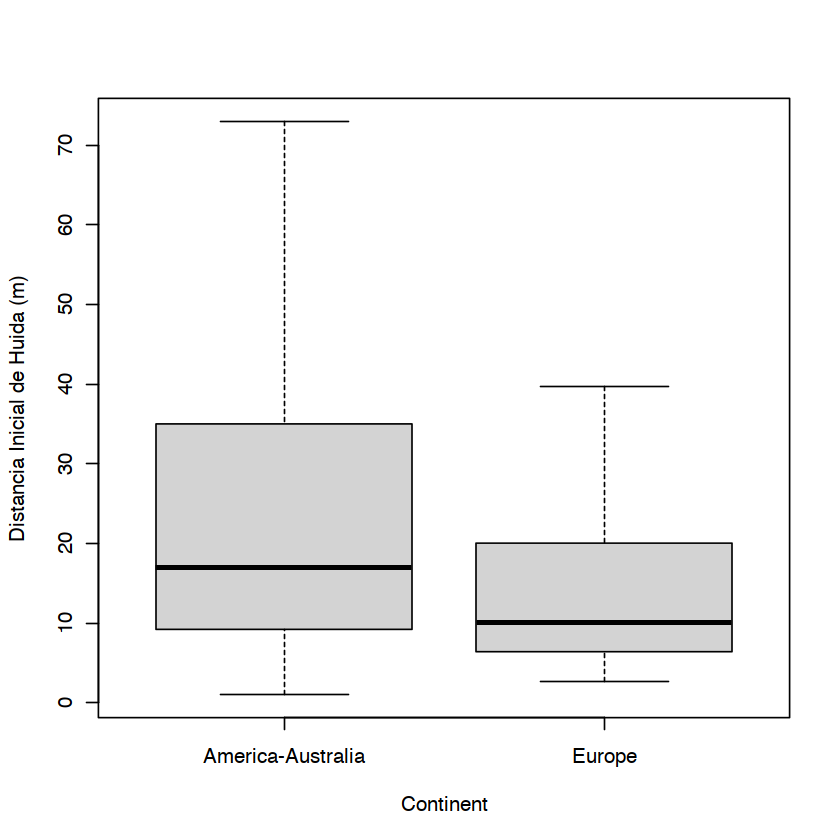
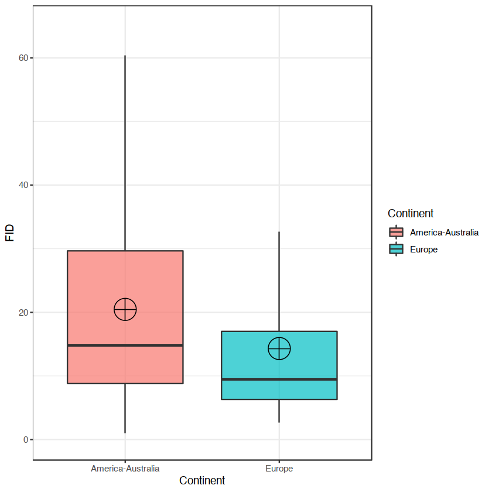
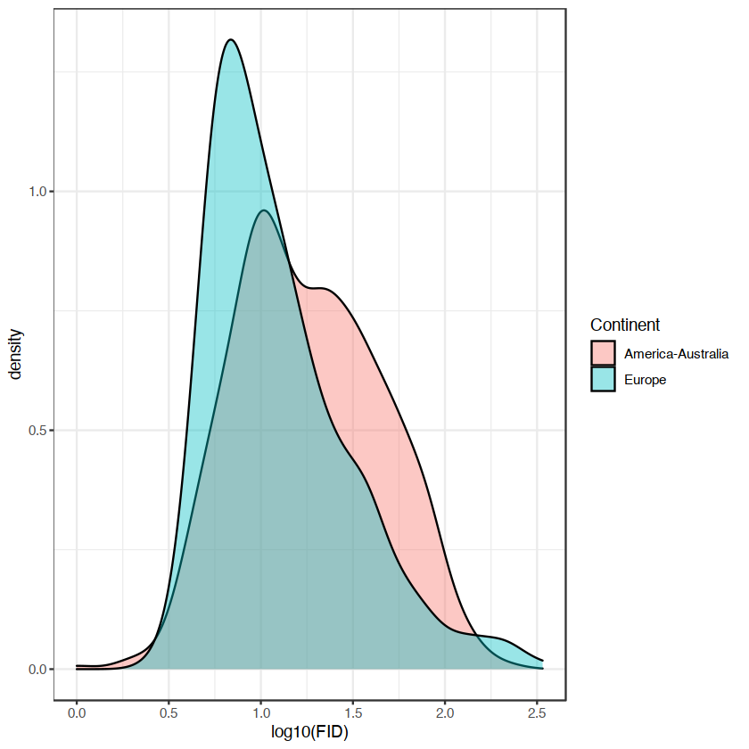
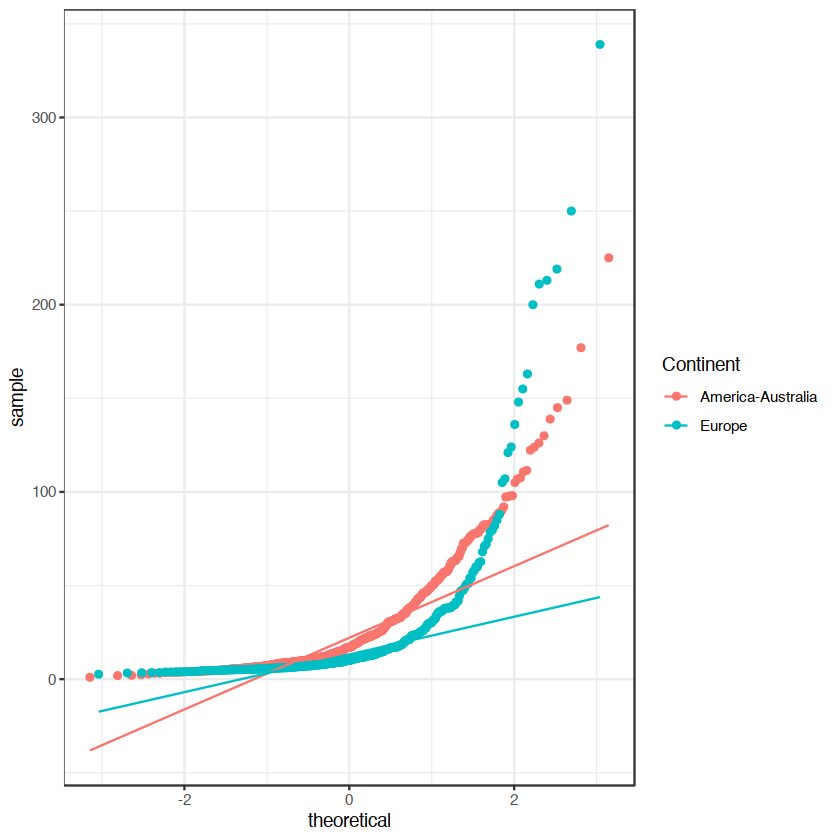

## Distancias de huida de aves de Europa frente a America-Australia

Las migraciones de los seres humanos han sido acompañadas de extinciones masivas de la fauna allá donde se han desplazado desde que partieron de Africa. <i>Homo sapiens</i> llego a Europa hace 150.000 años aproximadamente, colonizó el continente australiano desde Eurasia hace al menos 65.000 años, y finalmente la presencia humana en America se data en hace 30.000 años. La hipótesis es que los animales que han "conocido" a los humanos más recientemente tienen distancias de iniciacion de huida (FID, flight innitiation distance) menores (es decir menos miedo), por lo tanto se esperaría que las especies de aves en Europa tuvieran las distancias mayores en comparación con aquellas de otros contientes ya que han coevolucionado más tiempo con <i>Homo sapiens</i>.


```R
library(ggplot2)#graphic grammar
library(dplyr)#to organize data
library(car)#qqplots and others
library(lmtest)#test homogeneidad de varianza
library(effsize)#libreria para tamaños de efecto Cohen d
```


```R
FID.data<-read.csv("birdFID.csv")
head(FID.data,10)#primeras 10 lineas de datos
```


<table class="dataframe">
<caption>A data.frame: 10 × 9</caption>
<thead>
	<tr><th></th><th scope=col>X</th><th scope=col>Continent</th><th scope=col>Disturbance</th><th scope=col>Order</th><th scope=col>Family</th><th scope=col>Scientific.name</th><th scope=col>Common.name</th><th scope=col>FID</th><th scope=col>log.fid</th></tr>
	<tr><th></th><th scope=col>&lt;int&gt;</th><th scope=col>&lt;chr&gt;</th><th scope=col>&lt;chr&gt;</th><th scope=col>&lt;chr&gt;</th><th scope=col>&lt;chr&gt;</th><th scope=col>&lt;chr&gt;</th><th scope=col>&lt;chr&gt;</th><th scope=col>&lt;dbl&gt;</th><th scope=col>&lt;dbl&gt;</th></tr>
</thead>
<tbody>
	<tr><th scope=row>1</th><td> 1</td><td>America-Australia</td><td>Pedestrian</td><td>Anseriformes</td><td>Anatidae</td><td>Anas castanea     </td><td>chestnut teal      </td><td> 80.1</td><td>1.903633</td></tr>
	<tr><th scope=row>2</th><td> 2</td><td>America-Australia</td><td>Pedestrian</td><td>Anseriformes</td><td>Anatidae</td><td>Anas castanea     </td><td>chestnut teal      </td><td> 76.9</td><td>1.885926</td></tr>
	<tr><th scope=row>3</th><td> 3</td><td>America-Australia</td><td>Pedestrian</td><td>Anseriformes</td><td>Anatidae</td><td>Anas castanea     </td><td>chestnut teal      </td><td> 85.4</td><td>1.931458</td></tr>
	<tr><th scope=row>4</th><td> 4</td><td>America-Australia</td><td>Pedestrian</td><td>Anseriformes</td><td>Anatidae</td><td>Anas gracilis     </td><td>grey teal          </td><td> 78.0</td><td>1.892095</td></tr>
	<tr><th scope=row>5</th><td> 5</td><td>America-Australia</td><td>Pedestrian</td><td>Anseriformes</td><td>Anatidae</td><td>Anas gracilis     </td><td>grey teal          </td><td> 82.8</td><td>1.918030</td></tr>
	<tr><th scope=row>6</th><td> 6</td><td>America-Australia</td><td>Pedestrian</td><td>Anseriformes</td><td>Anatidae</td><td>Anas gracilis     </td><td>grey teal          </td><td> 82.5</td><td>1.916454</td></tr>
	<tr><th scope=row>7</th><td> 7</td><td>America-Australia</td><td>Pedestrian</td><td>Anseriformes</td><td>Anatidae</td><td>Anas superciliosa </td><td>Pacific black duck </td><td>107.5</td><td>2.031408</td></tr>
	<tr><th scope=row>8</th><td> 8</td><td>America-Australia</td><td>Pedestrian</td><td>Anseriformes</td><td>Anatidae</td><td>Anas superciliosa </td><td>Pacific black duck </td><td> 89.1</td><td>1.949878</td></tr>
	<tr><th scope=row>9</th><td> 9</td><td>America-Australia</td><td>Pedestrian</td><td>Anseriformes</td><td>Anatidae</td><td>Anas superciliosa </td><td>Pacific black duck </td><td> 97.9</td><td>1.990783</td></tr>
	<tr><th scope=row>10</th><td>10</td><td>America-Australia</td><td>Pedestrian</td><td>Anseriformes</td><td>Anatidae</td><td>Anas superciliosa </td><td>Pacific black duck </td><td> 46.0</td><td>1.662758</td></tr>
</tbody>
</table>


```R
#sumario de estadisticos para cada grupo
FID.data%>%
  group_by(Continent)%>%
  summarise(mean=mean(FID),median=median(FID),min=min(FID),
            max=max(FID),std=sd(FID),
            len=length(FID))
```


<table class="dataframe">
<caption>A tibble: 2 × 7</caption>
<thead>
	<tr><th></th><th scope=col>Continent</th><th scope=col>mean</th><th scope=col>median</th><th scope=col>min</th><th scope=col>max</th><th scope=col>std</th><th scope=col>len</th></tr>
	<tr><th></th><th scope=col>&lt;chr&gt;</th><th scope=col>&lt;dbl&gt;</th><th scope=col>&lt;dbl&gt;</th><th scope=col>&lt;dbl&gt;</th><th scope=col>&lt;dbl&gt;</th><th scope=col>&lt;dbl&gt;</th><th scope=col>&lt;int&gt;</th></tr>
</thead>
<tbody>
	<tr><th scope=row>1</th><td>America-Australia</td><td>27.31348</td><td>17.000</td><td>1.00</td><td>225</td><td>27.31681</td><td>606</td></tr>
	<tr><th scope=row>2</th><td>Europe           </td><td>21.05715</td><td>10.105</td><td>2.62</td><td>339</td><td>34.56178</td><td>424</td></tr>
</tbody>
</table>


```R
# sort the dataframe in R using arrange
FID.data %>% 
arrange(desc(FID))#los mas miedosos
```


<table class="dataframe">
<caption>A data.frame: 1030 × 9</caption>
<thead>
	<tr><th scope=col>X</th><th scope=col>Continent</th><th scope=col>Disturbance</th><th scope=col>Order</th><th scope=col>Family</th><th scope=col>Scientific.name</th><th scope=col>Common.name</th><th scope=col>FID</th><th scope=col>log.fid</th></tr>
	<tr><th scope=col>&lt;int&gt;</th><th scope=col>&lt;chr&gt;</th><th scope=col>&lt;chr&gt;</th><th scope=col>&lt;chr&gt;</th><th scope=col>&lt;chr&gt;</th><th scope=col>&lt;chr&gt;</th><th scope=col>&lt;chr&gt;</th><th scope=col>&lt;dbl&gt;</th><th scope=col>&lt;dbl&gt;</th></tr>
</thead>
<tbody>
	<tr><td>549</td><td>Europe           </td><td>Pedestrian</td><td>Charadriiformes</td><td>Scolopacidae     </td><td>Numenius arquata           </td><td>Eurasian curlew        </td><td>339.00</td><td>2.530200</td></tr>
	<tr><td>516</td><td>Europe           </td><td>Pedestrian</td><td>Anseriformes   </td><td>Anatidae         </td><td>Tadorna tadorna            </td><td>shelduck               </td><td>250.00</td><td>2.397940</td></tr>
	<tr><td>971</td><td>America-Australia</td><td>Pedestrian</td><td>Falconiformes  </td><td>Accipitridae     </td><td>Aguila chrysaetos          </td><td>golden eagle           </td><td>225.00</td><td>2.352183</td></tr>
	<tr><td>545</td><td>Europe           </td><td>Pedestrian</td><td>Charadriiformes</td><td>Scolopacidae     </td><td>Limosa lapponica           </td><td>bar-tailed godwit      </td><td>219.00</td><td>2.340444</td></tr>
	<tr><td>547</td><td>Europe           </td><td>Pedestrian</td><td>Charadriiformes</td><td>Scolopacidae     </td><td>Numenius arquata           </td><td>Eurasian curlew        </td><td>213.00</td><td>2.328380</td></tr>
	<tr><td>548</td><td>Europe           </td><td>Pedestrian</td><td>Charadriiformes</td><td>Scolopacidae     </td><td>Numenius arquata           </td><td>Eurasian curlew        </td><td>211.00</td><td>2.324282</td></tr>
	<tr><td>511</td><td>Europe           </td><td>Pedestrian</td><td>Anseriformes   </td><td>Anatidae         </td><td>Cygnus columbianus         </td><td>tundra swan            </td><td>200.00</td><td>2.301030</td></tr>
	<tr><td>972</td><td>America-Australia</td><td>Pedestrian</td><td>Falconiformes  </td><td>Accipitridae     </td><td>Buteo lagopus              </td><td>rough-legged hawk      </td><td>177.00</td><td>2.247973</td></tr>
	<tr><td>541</td><td>Europe           </td><td>Pedestrian</td><td>Charadriiformes</td><td>Scolopacidae     </td><td>Calidris alpina            </td><td>dunlin                 </td><td>163.00</td><td>2.212188</td></tr>
	<tr><td>512</td><td>Europe           </td><td>Pedestrian</td><td>Anseriformes   </td><td>Anatidae         </td><td>Cygnus cygnus              </td><td>whooper swan           </td><td>155.00</td><td>2.190332</td></tr>
	<tr><td> 35</td><td>America-Australia</td><td>Pedestrian</td><td>Anseriformes   </td><td>Anatidae         </td><td>Cygnus atratus             </td><td>black swan             </td><td>149.00</td><td>2.173186</td></tr>
	<tr><td>515</td><td>Europe           </td><td>Pedestrian</td><td>Anseriformes   </td><td>Anatidae         </td><td>Tadorna tadorna            </td><td>shelduck               </td><td>148.00</td><td>2.170262</td></tr>
	<tr><td> 37</td><td>America-Australia</td><td>Pedestrian</td><td>Anseriformes   </td><td>Anatidae         </td><td>Tadorna tadornoides        </td><td>Australian shelduck    </td><td>145.00</td><td>2.161368</td></tr>
	<tr><td> 32</td><td>America-Australia</td><td>Pedestrian</td><td>Anseriformes   </td><td>Anatidae         </td><td>Tadorna tadornoides        </td><td>Australian shelduck    </td><td>138.90</td><td>2.142702</td></tr>
	<tr><td>531</td><td>Europe           </td><td>Pedestrian</td><td>Charadriiformes</td><td>Haematopodidae   </td><td>Haematopus ostralegus      </td><td>Eurasian oystercatcher </td><td>136.00</td><td>2.133539</td></tr>
	<tr><td> 23</td><td>America-Australia</td><td>Pedestrian</td><td>Anseriformes   </td><td>Anatidae         </td><td>Dendrocygna eytoni         </td><td>plumed whistling duck  </td><td>130.00</td><td>2.113943</td></tr>
	<tr><td> 80</td><td>America-Australia</td><td>Pedestrian</td><td>Charadriiformes</td><td>Scolopacidae     </td><td>Numenius madagascariensis  </td><td>eastern curlew         </td><td>126.13</td><td>2.100818</td></tr>
	<tr><td>524</td><td>Europe           </td><td>Pedestrian</td><td>Charadriiformes</td><td>Charadriidae     </td><td>Pluvialis squatarola       </td><td>black-bellied plover   </td><td>124.00</td><td>2.093422</td></tr>
	<tr><td>240</td><td>America-Australia</td><td>Pedestrian</td><td>Pelicaniformes </td><td>Pelecanidae      </td><td>Pelecanus conspicillatus   </td><td>Australian pelican     </td><td>123.90</td><td>2.093071</td></tr>
	<tr><td> 30</td><td>America-Australia</td><td>Pedestrian</td><td>Anseriformes   </td><td>Anatidae         </td><td>Tadorna tadornoides        </td><td>Australian shelduck    </td><td>122.30</td><td>2.087426</td></tr>
	<tr><td>522</td><td>Europe           </td><td>Pedestrian</td><td>Charadriiformes</td><td>Charadriidae     </td><td>Charadrius hiaticula       </td><td>ringed plover          </td><td>121.00</td><td>2.082785</td></tr>
	<tr><td> 31</td><td>America-Australia</td><td>Pedestrian</td><td>Anseriformes   </td><td>Anatidae         </td><td>Tadorna tadornoides        </td><td>Australian shelduck    </td><td>111.50</td><td>2.047275</td></tr>
	<tr><td>114</td><td>America-Australia</td><td>Pedestrian</td><td>Ciconiiformes  </td><td>Threskiornithidae</td><td>Threskiornis spinicollis   </td><td>straw-necked ibis      </td><td>110.70</td><td>2.044148</td></tr>
	<tr><td>  7</td><td>America-Australia</td><td>Pedestrian</td><td>Anseriformes   </td><td>Anatidae         </td><td>Anas superciliosa          </td><td>Pacific black duck     </td><td>107.50</td><td>2.031408</td></tr>
	<tr><td>544</td><td>Europe           </td><td>Pedestrian</td><td>Charadriiformes</td><td>Scolopacidae     </td><td>Limosa lapponica           </td><td>bar-tailed godwit      </td><td>107.00</td><td>2.029384</td></tr>
	<tr><td> 33</td><td>America-Australia</td><td>Pedestrian</td><td>Anseriformes   </td><td>Anatidae         </td><td>Anas gracilis              </td><td>grey teal              </td><td>106.90</td><td>2.028978</td></tr>
	<tr><td> 18</td><td>America-Australia</td><td>Pedestrian</td><td>Anseriformes   </td><td>Anatidae         </td><td>Cereopsis novaehollandiae  </td><td>Cape Barren goose      </td><td>105.00</td><td>2.021189</td></tr>
	<tr><td>510</td><td>Europe           </td><td>Pedestrian</td><td>Anseriformes   </td><td>Anatidae         </td><td>Branta bernicla            </td><td>brant goose            </td><td>105.00</td><td>2.021189</td></tr>
	<tr><td> 27</td><td>America-Australia</td><td>Pedestrian</td><td>Anseriformes   </td><td>Anatidae         </td><td>Malacorhynchus membranaceus</td><td>pink-eared duck        </td><td> 98.00</td><td>1.991226</td></tr>
	<tr><td>  9</td><td>America-Australia</td><td>Pedestrian</td><td>Anseriformes   </td><td>Anatidae         </td><td>Anas superciliosa          </td><td>Pacific black duck     </td><td> 97.90</td><td>1.990783</td></tr>
	<tr><td>⋮</td><td>⋮</td><td>⋮</td><td>⋮</td><td>⋮</td><td>⋮</td><td>⋮</td><td>⋮</td><td>⋮</td></tr>
	<tr><td> 845</td><td>Europe           </td><td>Pedestrian</td><td>Passeriformes </td><td>Regulidae       </td><td>Regulus regulus                </td><td>goldcrest                </td><td>4.07</td><td>0.6095944</td></tr>
	<tr><td> 846</td><td>Europe           </td><td>Pedestrian</td><td>Passeriformes </td><td>Regulidae       </td><td>Regulus regulus                </td><td>goldcrest                </td><td>4.01</td><td>0.6031444</td></tr>
	<tr><td> 848</td><td>Europe           </td><td>Pedestrian</td><td>Passeriformes </td><td>Regulidae       </td><td>Regulus regulus                </td><td>goldcrest                </td><td>4.01</td><td>0.6031444</td></tr>
	<tr><td> 419</td><td>America-Australia</td><td>Pedestrian</td><td>Passeriformes </td><td>Meliphagidae    </td><td>Manorina melanophrys           </td><td>bell miner               </td><td>4.00</td><td>0.6020600</td></tr>
	<tr><td> 439</td><td>America-Australia</td><td>Pedestrian</td><td>Passeriformes </td><td>Orthonychidae   </td><td>Orthonyx spaldingii            </td><td>chowchilla               </td><td>4.00</td><td>0.6020600</td></tr>
	<tr><td> 450</td><td>America-Australia</td><td>Pedestrian</td><td>Passeriformes </td><td>Pardalotidae    </td><td>Pardalotus punctatus           </td><td>spotted pardalote        </td><td>4.00</td><td>0.6020600</td></tr>
	<tr><td> 687</td><td>Europe           </td><td>Pedestrian</td><td>Passeriformes </td><td>Fringillidae    </td><td>Carduelis spinus               </td><td>Eurasian siskin          </td><td>3.96</td><td>0.5976952</td></tr>
	<tr><td> 688</td><td>Europe           </td><td>Pedestrian</td><td>Passeriformes </td><td>Fringillidae    </td><td>Carduelis spinus               </td><td>Eurasian siskin          </td><td>3.96</td><td>0.5976952</td></tr>
	<tr><td> 689</td><td>Europe           </td><td>Pedestrian</td><td>Passeriformes </td><td>Fringillidae    </td><td>Carduelis spinus               </td><td>Eurasian siskin          </td><td>3.96</td><td>0.5976952</td></tr>
	<tr><td> 714</td><td>Europe           </td><td>Pedestrian</td><td>Passeriformes </td><td>Fringillidae    </td><td>Passer domesticus              </td><td>house sparrow            </td><td>3.83</td><td>0.5831988</td></tr>
	<tr><td> 716</td><td>Europe           </td><td>Pedestrian</td><td>Passeriformes </td><td>Fringillidae    </td><td>Passer domesticus              </td><td>house sparrow            </td><td>3.83</td><td>0.5831988</td></tr>
	<tr><td> 442</td><td>America-Australia</td><td>Pedestrian</td><td>Passeriformes </td><td>Pachycephalidae </td><td>Pachycephala olivacea          </td><td>olive whistler           </td><td>3.80</td><td>0.5797836</td></tr>
	<tr><td> 491</td><td>America-Australia</td><td>Pedestrian</td><td>Psittaciformes</td><td>Cacatuidae      </td><td>Cacatua tenuirostris           </td><td>long-billed corella      </td><td>3.80</td><td>0.5797836</td></tr>
	<tr><td>  34</td><td>America-Australia</td><td>Pedestrian</td><td>Anseriformes  </td><td>Anatidae        </td><td>Cygnus atratus                 </td><td>black swan               </td><td>3.60</td><td>0.5563025</td></tr>
	<tr><td> 169</td><td>America-Australia</td><td>Pedestrian</td><td>Passeriformes </td><td>Meliphagidae    </td><td>Acanthorhynchus tenuirostris   </td><td>eastern spinebill        </td><td>3.60</td><td>0.5563025</td></tr>
	<tr><td> 372</td><td>America-Australia</td><td>Pedestrian</td><td>Gruiformes    </td><td>Turnicidae      </td><td>Turnix pyrrhothorax            </td><td>red-chested button-quail </td><td>3.60</td><td>0.5563025</td></tr>
	<tr><td> 448</td><td>America-Australia</td><td>Pedestrian</td><td>Passeriformes </td><td>Pardalotidae    </td><td>Gerygone mouki                 </td><td>brown gerygone           </td><td>3.60</td><td>0.5563025</td></tr>
	<tr><td> 715</td><td>Europe           </td><td>Pedestrian</td><td>Passeriformes </td><td>Fringillidae    </td><td>Passer domesticus              </td><td>house sparrow            </td><td>3.51</td><td>0.5453071</td></tr>
	<tr><td> 352</td><td>America-Australia</td><td>Pedestrian</td><td>Cuculiformes  </td><td>Cuculidae       </td><td>Chalcites basalis              </td><td>Horsfield's bronze-cuckoo</td><td>3.50</td><td>0.5440680</td></tr>
	<tr><td> 562</td><td>Europe           </td><td>Pedestrian</td><td>Columbiformes </td><td>Columbidae      </td><td>Columba livia                  </td><td>rock dove                </td><td>3.50</td><td>0.5440680</td></tr>
	<tr><td> 807</td><td>Europe           </td><td>Pedestrian</td><td>Passeriformes </td><td>Paridae         </td><td>Parus ater                     </td><td>coal tit                 </td><td>3.40</td><td>0.5314789</td></tr>
	<tr><td> 766</td><td>Europe           </td><td>Pedestrian</td><td>Passeriformes </td><td>Motacillidae    </td><td>Anthus spinoletta              </td><td>water pipit              </td><td>3.28</td><td>0.5158738</td></tr>
	<tr><td> 385</td><td>America-Australia</td><td>Pedestrian</td><td>Passeriformes </td><td>Climacteridae   </td><td>Climacteris affinis            </td><td>white-browed treecreeper </td><td>3.10</td><td>0.4913617</td></tr>
	<tr><td>1024</td><td>America-Australia</td><td>Pedestrian</td><td>Strigiformes  </td><td>Strigidae       </td><td>Strix occidentalis occidentalis</td><td>Mexican spotted owl      </td><td>3.10</td><td>0.4913617</td></tr>
	<tr><td> 187</td><td>America-Australia</td><td>Pedestrian</td><td>Passeriformes </td><td>Meliphagidae    </td><td>Manorina melanophrys           </td><td>bell miner               </td><td>2.70</td><td>0.4313638</td></tr>
	<tr><td> 684</td><td>Europe           </td><td>Pedestrian</td><td>Passeriformes </td><td>Fringillidae    </td><td>Carduelis flammea              </td><td>common redpoll           </td><td>2.62</td><td>0.4183013</td></tr>
	<tr><td> 425</td><td>America-Australia</td><td>Pedestrian</td><td>Passeriformes </td><td>Meliphagidae    </td><td>Phylidonyris niger             </td><td>white-cheeked honeyeater </td><td>2.30</td><td>0.3617278</td></tr>
	<tr><td> 421</td><td>America-Australia</td><td>Pedestrian</td><td>Passeriformes </td><td>Meliphagidae    </td><td>Myzomela obscura               </td><td>dusky honeyeater         </td><td>2.00</td><td>0.3010300</td></tr>
	<tr><td> 363</td><td>America-Australia</td><td>Pedestrian</td><td>Galliformes   </td><td>Phasianidae     </td><td>Coturnix pectoralis            </td><td>stubble quail            </td><td>1.90</td><td>0.2787536</td></tr>
	<tr><td> 499</td><td>America-Australia</td><td>Pedestrian</td><td>Psittaciformes</td><td>Psittacidae     </td><td>Trichoglossus chlorolepidotus  </td><td>scaly-breasted lorikeet  </td><td>1.00</td><td>0.0000000</td></tr>
</tbody>
</table>


```R
boxplot(FID~Continent,data=FID.data,
        axes=T,outline=F,ylab="Distancia Inicial de Huida (m)")
```





```R
ggplot(FID.data, aes(x=Continent, y=FID, fill=Continent)) +
    geom_boxplot(alpha=0.7,outlier.shape=NA) +
    stat_summary(fun=mean, geom="point", shape=10, size=10, color="black", fill="red") +
    theme(legend.position="none")+
  ylim(0,65)+theme_bw()#la cruz indica la media
```

    Warning message:
    “Removed 80 rows containing non-finite values (stat_boxplot).”
    Warning message:
    “Removed 80 rows containing non-finite values (stat_summary).”





**Supuestos estadísticos**


```R
#normalidad
ggplot(FID.data,aes(x=FID,fill=Continent))+
  geom_density(alpha=0.4)+theme_bw()
#los FID no son normales para ningun grupo como se ve claramente en esta figura de densidad de FID
#asimetria positiva, hay muchas distancias concentradas entre 0 y 20m
```


```R
#transformando los datos a logaritmos en base 10
ggplot(FID.data,aes(x=log10(FID),fill=Continent))+
  geom_density(alpha=0.4)+theme_bw()
#las FID se normalizan, pero el qqplot abajo deja claramente que siguen sin ser normales
```





```R
ggplot(FID.data, aes(sample = FID,color=Continent))+stat_qq() + stat_qq_line() + theme_bw()#no es necesario hacer
#un ks test
```





```R
ggplot(FID.data, aes(sample = log10(FID),color=Continent))+stat_qq() + stat_qq_line() + theme_bw()
```


```R
leveneTest(log.fid~as.factor(Continent),data=FID.data)#no hay homogeneidad de varianza entre grupos
```


<table class="dataframe">
<caption>A anova: 2 × 3</caption>
<thead>
	<tr><th></th><th scope=col>Df</th><th scope=col>F value</th><th scope=col>Pr(&gt;F)</th></tr>
	<tr><th></th><th scope=col>&lt;int&gt;</th><th scope=col>&lt;dbl&gt;</th><th scope=col>&lt;dbl&gt;</th></tr>
</thead>
<tbody>
	<tr><th scope=row>group</th><td>   1</td><td>5.772112</td><td>0.01645893</td></tr>
	<tr><th scope=row> </th><td>1028</td><td>      NA</td><td>        NA</td></tr>
</tbody>
</table>


```R
dwtest(log.fid~Continent,data=FID.data)#tampoco hay indepencia de observaciones
```


    
    	Durbin-Watson test
    
    data:  log.fid ~ Continent
    DW = 0.54692, p-value < 2.2e-16
    alternative hypothesis: true autocorrelation is greater than 0


Necesitamos un análisis no paramétrico (Wilcoxon Rank Sum) para comparar los dos grupos


```R
(mu.test<-wilcox.test(FID~Continent,data=FID.data))
```


    
    	Wilcoxon rank sum test with continuity correction
    
    data:  FID by Continent
    W = 163098, p-value = 1.711e-13
    alternative hypothesis: true location shift is not equal to 0


```R
Zstat<-qnorm(mu.test$p.value/2)
```


```R
abs(Zstat)/sqrt(606+424)#tamano de efecto moderado:
```


0.229629587962364


```R
FID.data%>%
  group_by(Continent)%>%
  summarise(mean=mean(FID),median=median(FID),min=min(FID),
            max=max(FID),std=sd(FID),
            len=length(FID))
```


<table class="dataframe">
<caption>A tibble: 2 × 7</caption>
<thead>
	<tr><th></th><th scope=col>Continent</th><th scope=col>mean</th><th scope=col>median</th><th scope=col>min</th><th scope=col>max</th><th scope=col>std</th><th scope=col>len</th></tr>
	<tr><th></th><th scope=col>&lt;chr&gt;</th><th scope=col>&lt;dbl&gt;</th><th scope=col>&lt;dbl&gt;</th><th scope=col>&lt;dbl&gt;</th><th scope=col>&lt;dbl&gt;</th><th scope=col>&lt;dbl&gt;</th><th scope=col>&lt;int&gt;</th></tr>
</thead>
<tbody>
	<tr><th scope=row>1</th><td>America-Australia</td><td>27.31348</td><td>17.000</td><td>1.00</td><td>225</td><td>27.31681</td><td>606</td></tr>
	<tr><th scope=row>2</th><td>Europe           </td><td>21.05715</td><td>10.105</td><td>2.62</td><td>339</td><td>34.56178</td><td>424</td></tr>
</tbody>
</table>


**Interpretación estadística**. La FID presentada por las especies de aves en Europa (mediana = 10 metros) es menor que el presentado en las especies en America y Australia (mediana = 17), esta diferencia de 7 metros fue altamente significativa (W = 163098, p <0.001, n1 = 424, n2 = 606). El tamaño del efecto correspondiente a esta diferencia es moderado (0,23).
