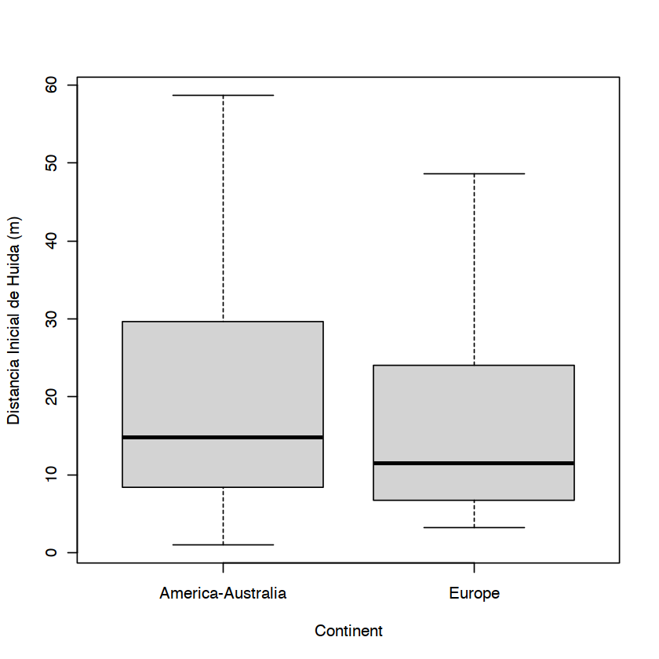
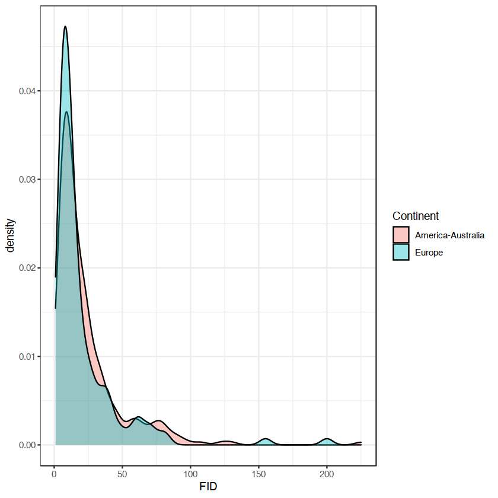
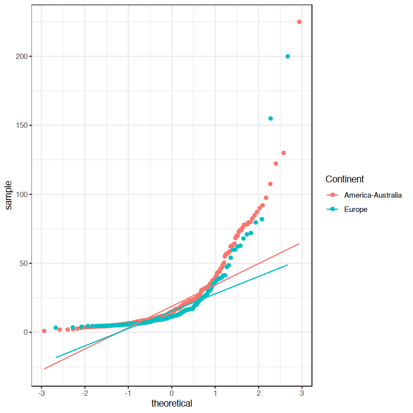

## Distancias de huida de aves de Europa frente a America-Australia


Las migraciones de los seres humanos han sido acompañadas de extinciones masivas de fauna allá donde se han desplazado desde que partieron de Africa. <i>Homo sapiens</i> llego a Europa hace 150.000 años aproximadamente, colonizó el continente australiano desde Eurasia hace al menos 65.000 años, y finalmente la presencia humana en America se data en hace 30.000 años. La hipótesis es que los animales que han "conocido" a los humanos más recientemente tienen distancias de iniciacion de huida (FID, flight innitiation distance) menores (es decir menos miedo), por lo tanto se esperaría que las especies de aves en Europa tuvieran las distancias mayores en comparación con aquellas de otros contientes ya que han coevolucionado más tiempo con <i>Homo sapiens</i>.

**Data source**: Livezey KB, Fernández-Juricic E, Blumstein DT. Database of bird flight initiation distances to assist in estimating effects from human disturbance and delineating buffer areas. Journal of Fish and Wildlife Management 7(1):181-191; e1944-687X. doi: 10.3996/082015-JFWM-078


```R
library(ggplot2)#graphic grammar
library(dplyr)#to organize data
library(car)#qqplots and others
library(lmtest)#test homogeneidad de varianza
library(effsize)#libreria para tamaños de efecto Cohen d
```


```R
FID.data<-read.csv("birdFID.csv")
head(FID.data)
dim(FID.data)
```


<table class="dataframe">
<caption>A data.frame: 6 × 8</caption>
<thead>
	<tr><th></th><th scope=col>Continent</th><th scope=col>Disturbance</th><th scope=col>Order</th><th scope=col>Family</th><th scope=col>Scientific.name</th><th scope=col>Common.name</th><th scope=col>FID</th><th scope=col>log.fid</th></tr>
	<tr><th></th><th scope=col>&lt;chr&gt;</th><th scope=col>&lt;chr&gt;</th><th scope=col>&lt;chr&gt;</th><th scope=col>&lt;chr&gt;</th><th scope=col>&lt;chr&gt;</th><th scope=col>&lt;chr&gt;</th><th scope=col>&lt;dbl&gt;</th><th scope=col>&lt;dbl&gt;</th></tr>
</thead>
<tbody>
	<tr><th scope=row>1</th><td>America-Australia</td><td>Pedestrian</td><td>Passeriformes</td><td>Meliphagidae </td><td>Acanthagenys rufogularis</td><td>spiny-cheeked honeyeater</td><td>9.2</td><td>0.9637878</td></tr>
	<tr><th scope=row>2</th><td>America-Australia</td><td>Pedestrian</td><td>Passeriformes</td><td>Pardalotidae </td><td>Acanthiza chrysorrhoa   </td><td>yellow-rumped thornbill </td><td>6.6</td><td>0.8195439</td></tr>
	<tr><th scope=row>3</th><td>America-Australia</td><td>Pedestrian</td><td>Passeriformes</td><td>Pardalotidae </td><td>Acanthiza lineata       </td><td>striated thornbill      </td><td>4.2</td><td>0.6232493</td></tr>
	<tr><th scope=row>4</th><td>America-Australia</td><td>Pedestrian</td><td>Passeriformes</td><td>Pardalotidae </td><td>Acanthiza nana          </td><td>yellow thornbill        </td><td>6.3</td><td>0.7993405</td></tr>
	<tr><th scope=row>5</th><td>America-Australia</td><td>Pedestrian</td><td>Passeriformes</td><td>Pardalotidae </td><td>Acanthiza pusilla       </td><td>brown thornbill         </td><td>4.3</td><td>0.6334685</td></tr>
	<tr><th scope=row>6</th><td>America-Australia</td><td>Pedestrian</td><td>Passeriformes</td><td>Pardalotidae </td><td>Acanthiza reguloides    </td><td>buff-rumped thornbill   </td><td>4.3</td><td>0.6334685</td></tr>
</tbody>
</table>


<style>
.list-inline {list-style: none; margin:0; padding: 0}
.list-inline>li {display: inline-block}
.list-inline>li:not(:last-child)::after {content: "\00b7"; padding: 0 .5ex}
</style>
<ol class=list-inline><li>434</li><li>8</li></ol>


```R
FID.data %>% 
arrange(desc(Scientific.name,Continent))#arrange by scientific name and continent
```


<table class="dataframe">
<caption>A data.frame: 434 × 8</caption>
<thead>
	<tr><th scope=col>Continent</th><th scope=col>Disturbance</th><th scope=col>Order</th><th scope=col>Family</th><th scope=col>Scientific.name</th><th scope=col>Common.name</th><th scope=col>FID</th><th scope=col>log.fid</th></tr>
	<tr><th scope=col>&lt;chr&gt;</th><th scope=col>&lt;chr&gt;</th><th scope=col>&lt;chr&gt;</th><th scope=col>&lt;chr&gt;</th><th scope=col>&lt;chr&gt;</th><th scope=col>&lt;chr&gt;</th><th scope=col>&lt;dbl&gt;</th><th scope=col>&lt;dbl&gt;</th></tr>
</thead>
<tbody>
	<tr><td>America-Australia</td><td>Pedestrian</td><td>Passeriformes  </td><td>Zosteropidae     </td><td>Zosterops lateralis          </td><td>silvereye               </td><td> 5.50</td><td>0.7403627</td></tr>
	<tr><td>America-Australia</td><td>Pedestrian</td><td>Passeriformes  </td><td>Muscicapidae     </td><td>Zoothera lunulata            </td><td>Bassian thrush          </td><td> 8.90</td><td>0.9493900</td></tr>
	<tr><td>America-Australia</td><td>Pedestrian</td><td>Passeriformes  </td><td>Muscicapidae     </td><td>Zoothera heinei              </td><td>russet-tailed thrush    </td><td>11.00</td><td>1.0413927</td></tr>
	<tr><td>America-Australia</td><td>Pedestrian</td><td>Passeriformes  </td><td>Emberizidae      </td><td>Zonotrichia leucophrys       </td><td>white-crowned sparrow   </td><td> 8.60</td><td>0.9344985</td></tr>
	<tr><td>America-Australia</td><td>Pedestrian</td><td>Columbiformes  </td><td>Columbidae       </td><td>Zenaida macroura             </td><td>mourning dove           </td><td>15.80</td><td>1.1986571</td></tr>
	<tr><td>Europe           </td><td>Pedestrian</td><td>Charadriiformes</td><td>Charadriidae     </td><td>Vanellus vanellus            </td><td>northern lapwing        </td><td>41.32</td><td>1.6161603</td></tr>
	<tr><td>America-Australia</td><td>Pedestrian</td><td>Charadriiformes</td><td>Charadriidae     </td><td>Vanellus tricolor            </td><td>banded lapwing          </td><td>74.00</td><td>1.8692317</td></tr>
	<tr><td>America-Australia</td><td>Pedestrian</td><td>Charadriiformes</td><td>Charadriidae     </td><td>Vanellus miles               </td><td>masked lapwing          </td><td>79.70</td><td>1.9014583</td></tr>
	<tr><td>Europe           </td><td>Pedestrian</td><td>Coraciiformes  </td><td>Upupidae         </td><td>Upupa epops                  </td><td>hoopoe                  </td><td>19.96</td><td>1.3001605</td></tr>
	<tr><td>America-Australia</td><td>Pedestrian</td><td>Gruiformes     </td><td>Turnicidae       </td><td>Turnix pyrrhothorax          </td><td>red-chested button-quail</td><td> 3.60</td><td>0.5563025</td></tr>
	<tr><td>Europe           </td><td>Pedestrian</td><td>Passeriformes  </td><td>Turdidae         </td><td>Turdus viscivorus            </td><td>mistle thrush           </td><td>19.33</td><td>1.2862319</td></tr>
	<tr><td>Europe           </td><td>Pedestrian</td><td>Passeriformes  </td><td>Turdidae         </td><td>Turdus pilaris               </td><td>fieldfare               </td><td>14.21</td><td>1.1525941</td></tr>
	<tr><td>Europe           </td><td>Pedestrian</td><td>Passeriformes  </td><td>Turdidae         </td><td>Turdus philomelos            </td><td>song thrush             </td><td>15.80</td><td>1.1986571</td></tr>
	<tr><td>America-Australia</td><td>Pedestrian</td><td>Passeriformes  </td><td>Turdidae         </td><td>Turdus migratorius           </td><td>American robin          </td><td>11.70</td><td>1.0681859</td></tr>
	<tr><td>America-Australia</td><td>Pedestrian</td><td>Passeriformes  </td><td>Turdidae         </td><td>Turdus merula                </td><td>common blackbird        </td><td>35.50</td><td>1.5502284</td></tr>
	<tr><td>Europe           </td><td>Pedestrian</td><td>Passeriformes  </td><td>Turdidae         </td><td>Turdus iliacus               </td><td>redwing                 </td><td>12.75</td><td>1.1055102</td></tr>
	<tr><td>Europe           </td><td>Pedestrian</td><td>Passeriformes  </td><td>Troglodytidae    </td><td>Troglodytes troglodytes      </td><td>Eurasian wren           </td><td> 5.64</td><td>0.7512791</td></tr>
	<tr><td>Europe           </td><td>Pedestrian</td><td>Charadriiformes</td><td>Scolopacidae     </td><td>Tringa totanus               </td><td>redshank                </td><td>29.71</td><td>1.4729027</td></tr>
	<tr><td>America-Australia</td><td>Pedestrian</td><td>Charadriiformes</td><td>Scolopacidae     </td><td>Tringa stagnatilis           </td><td>marsh sandpiper         </td><td>44.10</td><td>1.6444386</td></tr>
	<tr><td>America-Australia</td><td>Pedestrian</td><td>Charadriiformes</td><td>Scolopacidae     </td><td>Tringa nebularia             </td><td>common greenshank       </td><td>70.00</td><td>1.8450980</td></tr>
	<tr><td>America-Australia</td><td>Pedestrian</td><td>Charadriiformes</td><td>Scolopacidae     </td><td>Tringa melanoleuca           </td><td>greater yellowlegs      </td><td>23.00</td><td>1.3617278</td></tr>
	<tr><td>America-Australia</td><td>Pedestrian</td><td>Charadriiformes</td><td>Scolopacidae     </td><td>Tringa hypoleucos            </td><td>common sandpiper        </td><td>43.00</td><td>1.6334685</td></tr>
	<tr><td>America-Australia</td><td>Pedestrian</td><td>Charadriiformes</td><td>Scolopacidae     </td><td>Tringa brevipes              </td><td>grey-tailed tattler     </td><td>23.00</td><td>1.3617278</td></tr>
	<tr><td>America-Australia</td><td>Pedestrian</td><td>Psittaciformes </td><td>Psittacidae      </td><td>Trichoglossus haematodus     </td><td>rainbow lorikeet        </td><td>10.00</td><td>1.0000000</td></tr>
	<tr><td>America-Australia</td><td>Pedestrian</td><td>Psittaciformes </td><td>Psittacidae      </td><td>Trichoglossus chlorolepidotus</td><td>scaly-breasted lorikeet </td><td> 1.00</td><td>0.0000000</td></tr>
	<tr><td>America-Australia</td><td>Pedestrian</td><td>Passeriformes  </td><td>Petroicidae      </td><td>Tregellasia capito           </td><td>pale-yellow robin       </td><td> 8.50</td><td>0.9294189</td></tr>
	<tr><td>America-Australia</td><td>Pedestrian</td><td>Coraciiformes  </td><td>Halcyonidae      </td><td>Todiramphus sanctus          </td><td>sacred kingfisher       </td><td>20.90</td><td>1.3201463</td></tr>
	<tr><td>America-Australia</td><td>Pedestrian</td><td>Coraciiformes  </td><td>Halcyonidae      </td><td>Todiramphus macleayii        </td><td>forest kingfisher       </td><td>11.00</td><td>1.0413927</td></tr>
	<tr><td>America-Australia</td><td>Pedestrian</td><td>Ciconiiformes  </td><td>Threskiornithidae</td><td>Threskornis molucca          </td><td>Australian white ibis   </td><td>35.03</td><td>1.5444401</td></tr>
	<tr><td>America-Australia</td><td>Pedestrian</td><td>Ciconiiformes  </td><td>Threskiornithidae</td><td>Threskiornis spinicollis     </td><td>straw-necked ibis       </td><td>84.90</td><td>1.9289077</td></tr>
	<tr><td>⋮</td><td>⋮</td><td>⋮</td><td>⋮</td><td>⋮</td><td>⋮</td><td>⋮</td><td>⋮</td></tr>
	<tr><td>America-Australia</td><td>Pedestrian</td><td>Pelicaniformes</td><td>Anhingidae        </td><td>Anhinga melanogaster         </td><td>darter                  </td><td> 24.00</td><td>1.3802112</td></tr>
	<tr><td>America-Australia</td><td>Pedestrian</td><td>Anseriformes  </td><td>Anatidae          </td><td>Anas superciliosa            </td><td>Pacific black duck      </td><td>107.50</td><td>2.0314085</td></tr>
	<tr><td>America-Australia</td><td>Pedestrian</td><td>Anseriformes  </td><td>Anatidae          </td><td>Anas rhynchotis              </td><td>Australasian shoveler   </td><td> 19.20</td><td>1.2833012</td></tr>
	<tr><td>America-Australia</td><td>Pedestrian</td><td>Anseriformes  </td><td>Anatidae          </td><td>Anas platyrhynchos           </td><td>mallard                 </td><td> 12.80</td><td>1.1072100</td></tr>
	<tr><td>America-Australia</td><td>Pedestrian</td><td>Anseriformes  </td><td>Anatidae          </td><td>Anas gracilis                </td><td>grey teal               </td><td> 78.00</td><td>1.8920946</td></tr>
	<tr><td>Europe           </td><td>Pedestrian</td><td>Anseriformes  </td><td>Anatidae          </td><td>Anas crecca                  </td><td>Eurasian teal           </td><td> 39.23</td><td>1.5936183</td></tr>
	<tr><td>America-Australia</td><td>Pedestrian</td><td>Anseriformes  </td><td>Anatidae          </td><td>Anas castanea                </td><td>chestnut teal           </td><td> 80.10</td><td>1.9036325</td></tr>
	<tr><td>Europe           </td><td>Pedestrian</td><td>Passeriformes </td><td>Estrildidae       </td><td>Amandava amandava            </td><td>red avadavat            </td><td>  6.55</td><td>0.8162413</td></tr>
	<tr><td>America-Australia</td><td>Pedestrian</td><td>Psittaciformes</td><td>Psittacidae       </td><td>Alisterus scapularis         </td><td>Australian king parrot  </td><td>  8.70</td><td>0.9395193</td></tr>
	<tr><td>America-Australia</td><td>Pedestrian</td><td>Galliformes   </td><td>Megapodiidae      </td><td>Alectura lathami             </td><td>Australian brush turkey </td><td> 12.00</td><td>1.0791812</td></tr>
	<tr><td>Europe           </td><td>Pedestrian</td><td>Galliformes   </td><td>Phasianidae       </td><td>Alectoris rufa               </td><td>red-legged partridge    </td><td> 30.00</td><td>1.4771213</td></tr>
	<tr><td>Europe           </td><td>Pedestrian</td><td>Coraciiformes </td><td>Alcedinidae       </td><td>Alcedo atthis                </td><td>Eurasian kingfisher     </td><td> 16.27</td><td>1.2113876</td></tr>
	<tr><td>Europe           </td><td>Pedestrian</td><td>Passeriformes </td><td>Alaudidae         </td><td>Alauda arvensis              </td><td>skylark                 </td><td> 14.90</td><td>1.1731863</td></tr>
	<tr><td>America-Australia</td><td>Pedestrian</td><td>Passeriformes </td><td>Ptilonorhynchidae </td><td>Ailuroedus melanotis         </td><td>spotted catbird         </td><td> 18.70</td><td>1.2718416</td></tr>
	<tr><td>America-Australia</td><td>Pedestrian</td><td>Passeriformes </td><td>Ptilonorhynchidae </td><td>Ailuroedus crassirostris     </td><td>green catbird           </td><td>  9.70</td><td>0.9867717</td></tr>
	<tr><td>America-Australia</td><td>Pedestrian</td><td>Falconiformes </td><td>Accipitridae      </td><td>Aguila chrysaetos            </td><td>golden eagle            </td><td>225.00</td><td>2.3521825</td></tr>
	<tr><td>Europe           </td><td>Pedestrian</td><td>Passeriformes </td><td>Aegithalidae      </td><td>Aegithalos caudatus          </td><td>long-tailed tit         </td><td>  4.64</td><td>0.6665180</td></tr>
	<tr><td>America-Australia</td><td>Pedestrian</td><td>Passeriformes </td><td>Sylviidae         </td><td>Acrocephalus stentoreus      </td><td>clamorous reed-warbler  </td><td> 11.50</td><td>1.0606978</td></tr>
	<tr><td>Europe           </td><td>Pedestrian</td><td>Passeriformes </td><td>Sylviidae         </td><td>Acrocephalus schoenobaenus   </td><td>sedge warbler           </td><td>  7.56</td><td>0.8785218</td></tr>
	<tr><td>Europe           </td><td>Pedestrian</td><td>Passeriformes </td><td>Sylviidae         </td><td>Acrocephalus palustris       </td><td>marsh warbler           </td><td>  8.84</td><td>0.9464523</td></tr>
	<tr><td>America-Australia</td><td>Pedestrian</td><td>Passeriformes </td><td>Sturnidae         </td><td>Acridotheres tristis         </td><td>common myna             </td><td> 11.60</td><td>1.0644580</td></tr>
	<tr><td>America-Australia</td><td>Pedestrian</td><td>Falconiformes </td><td>Accipitridae      </td><td>Accipiter novaehollandiae    </td><td>grey goshawk            </td><td> 24.60</td><td>1.3909351</td></tr>
	<tr><td>Europe           </td><td>Pedestrian</td><td>Falconiformes </td><td>Accipitridae      </td><td>Accipiter nisus              </td><td>Eurasian sparrowhawk    </td><td> 10.00</td><td>1.0000000</td></tr>
	<tr><td>America-Australia</td><td>Pedestrian</td><td>Passeriformes </td><td>Meliphagidae      </td><td>Acanthorhynchus tenuirostris </td><td>eastern spinebill       </td><td>  5.60</td><td>0.7481880</td></tr>
	<tr><td>America-Australia</td><td>Pedestrian</td><td>Passeriformes </td><td>Pardalotidae      </td><td>Acanthiza reguloides         </td><td>buff-rumped thornbill   </td><td>  4.30</td><td>0.6334685</td></tr>
	<tr><td>America-Australia</td><td>Pedestrian</td><td>Passeriformes </td><td>Pardalotidae      </td><td>Acanthiza pusilla            </td><td>brown thornbill         </td><td>  4.30</td><td>0.6334685</td></tr>
	<tr><td>America-Australia</td><td>Pedestrian</td><td>Passeriformes </td><td>Pardalotidae      </td><td>Acanthiza nana               </td><td>yellow thornbill        </td><td>  6.30</td><td>0.7993405</td></tr>
	<tr><td>America-Australia</td><td>Pedestrian</td><td>Passeriformes </td><td>Pardalotidae      </td><td>Acanthiza lineata            </td><td>striated thornbill      </td><td>  4.20</td><td>0.6232493</td></tr>
	<tr><td>America-Australia</td><td>Pedestrian</td><td>Passeriformes </td><td>Pardalotidae      </td><td>Acanthiza chrysorrhoa        </td><td>yellow-rumped thornbill </td><td>  6.60</td><td>0.8195439</td></tr>
	<tr><td>America-Australia</td><td>Pedestrian</td><td>Passeriformes </td><td>Meliphagidae      </td><td>Acanthagenys rufogularis     </td><td>spiny-cheeked honeyeater</td><td>  9.20</td><td>0.9637878</td></tr>
</tbody>
</table>


```R
# Remove duplicated rows by scientific name
FID.data %>% distinct(Scientific.name, .keep_all=TRUE)
dim(FID.data)
```


<table class="dataframe">
<caption>A data.frame: 434 × 8</caption>
<thead>
	<tr><th scope=col>Continent</th><th scope=col>Disturbance</th><th scope=col>Order</th><th scope=col>Family</th><th scope=col>Scientific.name</th><th scope=col>Common.name</th><th scope=col>FID</th><th scope=col>log.fid</th></tr>
	<tr><th scope=col>&lt;chr&gt;</th><th scope=col>&lt;chr&gt;</th><th scope=col>&lt;chr&gt;</th><th scope=col>&lt;chr&gt;</th><th scope=col>&lt;chr&gt;</th><th scope=col>&lt;chr&gt;</th><th scope=col>&lt;dbl&gt;</th><th scope=col>&lt;dbl&gt;</th></tr>
</thead>
<tbody>
	<tr><td>America-Australia</td><td>Pedestrian</td><td>Passeriformes </td><td>Meliphagidae      </td><td>Acanthagenys rufogularis     </td><td>spiny-cheeked honeyeater        </td><td>  9.2</td><td>0.9637878</td></tr>
	<tr><td>America-Australia</td><td>Pedestrian</td><td>Passeriformes </td><td>Pardalotidae      </td><td>Acanthiza chrysorrhoa        </td><td>yellow-rumped thornbill         </td><td>  6.6</td><td>0.8195439</td></tr>
	<tr><td>America-Australia</td><td>Pedestrian</td><td>Passeriformes </td><td>Pardalotidae      </td><td>Acanthiza lineata            </td><td>striated thornbill              </td><td>  4.2</td><td>0.6232493</td></tr>
	<tr><td>America-Australia</td><td>Pedestrian</td><td>Passeriformes </td><td>Pardalotidae      </td><td>Acanthiza nana               </td><td>yellow thornbill                </td><td>  6.3</td><td>0.7993405</td></tr>
	<tr><td>America-Australia</td><td>Pedestrian</td><td>Passeriformes </td><td>Pardalotidae      </td><td>Acanthiza pusilla            </td><td>brown thornbill                 </td><td>  4.3</td><td>0.6334685</td></tr>
	<tr><td>America-Australia</td><td>Pedestrian</td><td>Passeriformes </td><td>Pardalotidae      </td><td>Acanthiza reguloides         </td><td>buff-rumped thornbill           </td><td>  4.3</td><td>0.6334685</td></tr>
	<tr><td>America-Australia</td><td>Pedestrian</td><td>Passeriformes </td><td>Meliphagidae      </td><td>Acanthorhynchus tenuirostris </td><td>eastern spinebill               </td><td>  5.6</td><td>0.7481880</td></tr>
	<tr><td>America-Australia</td><td>Pedestrian</td><td>Falconiformes </td><td>Accipitridae      </td><td>Accipiter novaehollandiae    </td><td>grey goshawk                    </td><td> 24.6</td><td>1.3909351</td></tr>
	<tr><td>America-Australia</td><td>Pedestrian</td><td>Passeriformes </td><td>Sturnidae         </td><td>Acridotheres tristis         </td><td>common myna                     </td><td> 11.6</td><td>1.0644580</td></tr>
	<tr><td>America-Australia</td><td>Pedestrian</td><td>Passeriformes </td><td>Sylviidae         </td><td>Acrocephalus stentoreus      </td><td>clamorous reed-warbler          </td><td> 11.5</td><td>1.0606978</td></tr>
	<tr><td>America-Australia</td><td>Pedestrian</td><td>Falconiformes </td><td>Accipitridae      </td><td>Aguila chrysaetos            </td><td>golden eagle                    </td><td>225.0</td><td>2.3521825</td></tr>
	<tr><td>America-Australia</td><td>Pedestrian</td><td>Passeriformes </td><td>Ptilonorhynchidae </td><td>Ailuroedus crassirostris     </td><td>green catbird                   </td><td>  9.7</td><td>0.9867717</td></tr>
	<tr><td>America-Australia</td><td>Pedestrian</td><td>Passeriformes </td><td>Ptilonorhynchidae </td><td>Ailuroedus melanotis         </td><td>spotted catbird                 </td><td> 18.7</td><td>1.2718416</td></tr>
	<tr><td>America-Australia</td><td>Pedestrian</td><td>Galliformes   </td><td>Megapodiidae      </td><td>Alectura lathami             </td><td>Australian brush turkey         </td><td> 12.0</td><td>1.0791812</td></tr>
	<tr><td>America-Australia</td><td>Pedestrian</td><td>Psittaciformes</td><td>Psittacidae       </td><td>Alisterus scapularis         </td><td>Australian king parrot          </td><td>  8.7</td><td>0.9395193</td></tr>
	<tr><td>America-Australia</td><td>Pedestrian</td><td>Anseriformes  </td><td>Anatidae          </td><td>Anas castanea                </td><td>chestnut teal                   </td><td> 80.1</td><td>1.9036325</td></tr>
	<tr><td>America-Australia</td><td>Pedestrian</td><td>Anseriformes  </td><td>Anatidae          </td><td>Anas gracilis                </td><td>grey teal                       </td><td> 78.0</td><td>1.8920946</td></tr>
	<tr><td>America-Australia</td><td>Pedestrian</td><td>Anseriformes  </td><td>Anatidae          </td><td>Anas platyrhynchos           </td><td>mallard                         </td><td> 12.8</td><td>1.1072100</td></tr>
	<tr><td>America-Australia</td><td>Pedestrian</td><td>Anseriformes  </td><td>Anatidae          </td><td>Anas rhynchotis              </td><td>Australasian shoveler           </td><td> 19.2</td><td>1.2833012</td></tr>
	<tr><td>America-Australia</td><td>Pedestrian</td><td>Anseriformes  </td><td>Anatidae          </td><td>Anas superciliosa            </td><td>Pacific black duck              </td><td>107.5</td><td>2.0314085</td></tr>
	<tr><td>America-Australia</td><td>Pedestrian</td><td>Pelicaniformes</td><td>Anhingidae        </td><td>Anhinga melanogaster         </td><td>darter                          </td><td> 24.0</td><td>1.3802112</td></tr>
	<tr><td>America-Australia</td><td>Pedestrian</td><td>Pelicaniformes</td><td>Anhingidae        </td><td>Anhinga novaehollandiae      </td><td>Australian darter               </td><td> 38.0</td><td>1.5797836</td></tr>
	<tr><td>America-Australia</td><td>Pedestrian</td><td>Anseriformes  </td><td>Anatidae          </td><td>Anser albifrons elgasi       </td><td>tule greater white-fronted goose</td><td> 47.0</td><td>1.6720979</td></tr>
	<tr><td>America-Australia</td><td>Pedestrian</td><td>Passeriformes </td><td>Meliphagidae      </td><td>Anthochaera carunculata      </td><td>red wattlebird                  </td><td>  8.7</td><td>0.9395193</td></tr>
	<tr><td>America-Australia</td><td>Pedestrian</td><td>Passeriformes </td><td>Meliphagidae      </td><td>Anthochaera chrysoptera      </td><td>little wattlebird               </td><td>  7.3</td><td>0.8633229</td></tr>
	<tr><td>America-Australia</td><td>Pedestrian</td><td>Passeriformes </td><td>Motacillidae      </td><td>Anthus novaeseelandiae       </td><td>richard’s pipit               </td><td> 12.4</td><td>1.0934217</td></tr>
	<tr><td>America-Australia</td><td>Pedestrian</td><td>Passeriformes </td><td>Corvidae          </td><td>Aphelocoma californica       </td><td>western scrub-jay               </td><td> 15.0</td><td>1.1760913</td></tr>
	<tr><td>America-Australia</td><td>Pedestrian</td><td>Psittaciformes</td><td>Psittacidae       </td><td>Aprosmictus erythropterus    </td><td>red-winged parrot               </td><td> 32.3</td><td>1.5092025</td></tr>
	<tr><td>America-Australia</td><td>Pedestrian</td><td>Ciconiiformes </td><td>Ardeidae          </td><td>Ardea alba                   </td><td>great egret                     </td><td> 39.9</td><td>1.6009729</td></tr>
	<tr><td>America-Australia</td><td>Pedestrian</td><td>Ciconiiformes </td><td>Ardeidae          </td><td>Ardea herodias               </td><td>great blue heron                </td><td> 15.0</td><td>1.1760913</td></tr>
	<tr><td>⋮</td><td>⋮</td><td>⋮</td><td>⋮</td><td>⋮</td><td>⋮</td><td>⋮</td><td>⋮</td></tr>
	<tr><td>Europe</td><td>Pedestrian</td><td>Passeriformes  </td><td>Prunellidae  </td><td>Prunella modularis     </td><td>dunnock               </td><td> 9.20</td><td>0.9637878</td></tr>
	<tr><td>Europe</td><td>Pedestrian</td><td>Passeriformes  </td><td>Fringillidae </td><td>Pyrrhula pyrrhula      </td><td>Eurasian bullfinch    </td><td> 5.90</td><td>0.7708520</td></tr>
	<tr><td>Europe</td><td>Pedestrian</td><td>Passeriformes  </td><td>Regulidae    </td><td>Regulus ignicapillus   </td><td>common firecrest      </td><td> 5.25</td><td>0.7201593</td></tr>
	<tr><td>Europe</td><td>Pedestrian</td><td>Passeriformes  </td><td>Regulidae    </td><td>Regulus regulus        </td><td>goldcrest             </td><td> 4.07</td><td>0.6095944</td></tr>
	<tr><td>Europe</td><td>Pedestrian</td><td>Passeriformes  </td><td>Remizidae    </td><td>Remiz pendulinus       </td><td>Eurasian penduline tit</td><td> 6.17</td><td>0.7902852</td></tr>
	<tr><td>Europe</td><td>Pedestrian</td><td>Passeriformes  </td><td>Hirundinidae </td><td>Riparia riparia        </td><td>sand martin           </td><td>23.10</td><td>1.3636120</td></tr>
	<tr><td>Europe</td><td>Pedestrian</td><td>Passeriformes  </td><td>Muscicapidae </td><td>Saxicola rubetra       </td><td>whinchat              </td><td>16.65</td><td>1.2214142</td></tr>
	<tr><td>Europe</td><td>Pedestrian</td><td>Passeriformes  </td><td>Muscicapidae </td><td>Saxicola torquata      </td><td>African stonechat     </td><td> 9.14</td><td>0.9609462</td></tr>
	<tr><td>Europe</td><td>Pedestrian</td><td>Passeriformes  </td><td>Fringillidae </td><td>Serinus serinus        </td><td>European serin        </td><td> 5.07</td><td>0.7050080</td></tr>
	<tr><td>Europe</td><td>Pedestrian</td><td>Passeriformes  </td><td>Sittidae     </td><td>Sitta europaea         </td><td>Eurasian nuthatch     </td><td> 6.59</td><td>0.8188854</td></tr>
	<tr><td>Europe</td><td>Pedestrian</td><td>Columbiformes  </td><td>Columbidae   </td><td>Streptopelia decaocto  </td><td>Eurasian collared dove</td><td> 5.38</td><td>0.7307823</td></tr>
	<tr><td>Europe</td><td>Pedestrian</td><td>Passeriformes  </td><td>Sylviidae    </td><td>Sylvia atricapilla     </td><td>blackcap              </td><td> 5.73</td><td>0.7581546</td></tr>
	<tr><td>Europe</td><td>Pedestrian</td><td>Passeriformes  </td><td>Sylviidae    </td><td>Sylvia borin           </td><td>garden warbler        </td><td> 6.44</td><td>0.8088859</td></tr>
	<tr><td>Europe</td><td>Pedestrian</td><td>Passeriformes  </td><td>Sylviidae    </td><td>Sylvia cantillans      </td><td>subalpine warbler     </td><td> 5.69</td><td>0.7551123</td></tr>
	<tr><td>Europe</td><td>Pedestrian</td><td>Passeriformes  </td><td>Sylviidae    </td><td>Sylvia communis        </td><td>whitethroat           </td><td>11.70</td><td>1.0681859</td></tr>
	<tr><td>Europe</td><td>Pedestrian</td><td>Passeriformes  </td><td>Sylviidae    </td><td>Sylvia conspicillata   </td><td>spectacled warbler    </td><td> 7.27</td><td>0.8615344</td></tr>
	<tr><td>Europe</td><td>Pedestrian</td><td>Passeriformes  </td><td>Sylviidae    </td><td>Sylvia curruca         </td><td>lesser whitethroat    </td><td> 4.70</td><td>0.6720979</td></tr>
	<tr><td>Europe</td><td>Pedestrian</td><td>Passeriformes  </td><td>Sylviidae    </td><td>Sylvia melanocephala   </td><td>Sardinian warbler     </td><td> 5.90</td><td>0.7708520</td></tr>
	<tr><td>Europe</td><td>Pedestrian</td><td>Passeriformes  </td><td>Sylviidae    </td><td>Sylvia undata          </td><td>Dartford warbler      </td><td>10.86</td><td>1.0358298</td></tr>
	<tr><td>Europe</td><td>Pedestrian</td><td>Anseriformes   </td><td>Anatidae     </td><td>Tadorna tadorna        </td><td>shelduck              </td><td>48.57</td><td>1.6863681</td></tr>
	<tr><td>Europe</td><td>Pedestrian</td><td>Galliformes    </td><td>Tetraonidae  </td><td>Tetrao tetrix          </td><td>black grouse          </td><td>17.00</td><td>1.2304489</td></tr>
	<tr><td>Europe</td><td>Pedestrian</td><td>Galliformes    </td><td>Tetraonidae  </td><td>Tetrao urogallus       </td><td>capercaillie          </td><td>27.00</td><td>1.4313638</td></tr>
	<tr><td>Europe</td><td>Pedestrian</td><td>Charadriiformes</td><td>Scolopacidae </td><td>Tringa totanus         </td><td>redshank              </td><td>29.71</td><td>1.4729027</td></tr>
	<tr><td>Europe</td><td>Pedestrian</td><td>Passeriformes  </td><td>Troglodytidae</td><td>Troglodytes troglodytes</td><td>Eurasian wren         </td><td> 5.64</td><td>0.7512791</td></tr>
	<tr><td>Europe</td><td>Pedestrian</td><td>Passeriformes  </td><td>Turdidae     </td><td>Turdus iliacus         </td><td>redwing               </td><td>12.75</td><td>1.1055102</td></tr>
	<tr><td>Europe</td><td>Pedestrian</td><td>Passeriformes  </td><td>Turdidae     </td><td>Turdus philomelos      </td><td>song thrush           </td><td>15.80</td><td>1.1986571</td></tr>
	<tr><td>Europe</td><td>Pedestrian</td><td>Passeriformes  </td><td>Turdidae     </td><td>Turdus pilaris         </td><td>fieldfare             </td><td>14.21</td><td>1.1525941</td></tr>
	<tr><td>Europe</td><td>Pedestrian</td><td>Passeriformes  </td><td>Turdidae     </td><td>Turdus viscivorus      </td><td>mistle thrush         </td><td>19.33</td><td>1.2862319</td></tr>
	<tr><td>Europe</td><td>Pedestrian</td><td>Coraciiformes  </td><td>Upupidae     </td><td>Upupa epops            </td><td>hoopoe                </td><td>19.96</td><td>1.3001605</td></tr>
	<tr><td>Europe</td><td>Pedestrian</td><td>Charadriiformes</td><td>Charadriidae </td><td>Vanellus vanellus      </td><td>northern lapwing      </td><td>41.32</td><td>1.6161603</td></tr>
</tbody>
</table>


<style>
.list-inline {list-style: none; margin:0; padding: 0}
.list-inline>li {display: inline-block}
.list-inline>li:not(:last-child)::after {content: "\00b7"; padding: 0 .5ex}
</style>
<ol class=list-inline><li>434</li><li>8</li></ol>


```R
# Remove duplicated rows
FID.data %>% distinct()
dim(FID.data)
```


<table class="dataframe">
<caption>A data.frame: 434 × 8</caption>
<thead>
	<tr><th scope=col>Continent</th><th scope=col>Disturbance</th><th scope=col>Order</th><th scope=col>Family</th><th scope=col>Scientific.name</th><th scope=col>Common.name</th><th scope=col>FID</th><th scope=col>log.fid</th></tr>
	<tr><th scope=col>&lt;chr&gt;</th><th scope=col>&lt;chr&gt;</th><th scope=col>&lt;chr&gt;</th><th scope=col>&lt;chr&gt;</th><th scope=col>&lt;chr&gt;</th><th scope=col>&lt;chr&gt;</th><th scope=col>&lt;dbl&gt;</th><th scope=col>&lt;dbl&gt;</th></tr>
</thead>
<tbody>
	<tr><td>America-Australia</td><td>Pedestrian</td><td>Passeriformes </td><td>Meliphagidae      </td><td>Acanthagenys rufogularis     </td><td>spiny-cheeked honeyeater        </td><td>  9.2</td><td>0.9637878</td></tr>
	<tr><td>America-Australia</td><td>Pedestrian</td><td>Passeriformes </td><td>Pardalotidae      </td><td>Acanthiza chrysorrhoa        </td><td>yellow-rumped thornbill         </td><td>  6.6</td><td>0.8195439</td></tr>
	<tr><td>America-Australia</td><td>Pedestrian</td><td>Passeriformes </td><td>Pardalotidae      </td><td>Acanthiza lineata            </td><td>striated thornbill              </td><td>  4.2</td><td>0.6232493</td></tr>
	<tr><td>America-Australia</td><td>Pedestrian</td><td>Passeriformes </td><td>Pardalotidae      </td><td>Acanthiza nana               </td><td>yellow thornbill                </td><td>  6.3</td><td>0.7993405</td></tr>
	<tr><td>America-Australia</td><td>Pedestrian</td><td>Passeriformes </td><td>Pardalotidae      </td><td>Acanthiza pusilla            </td><td>brown thornbill                 </td><td>  4.3</td><td>0.6334685</td></tr>
	<tr><td>America-Australia</td><td>Pedestrian</td><td>Passeriformes </td><td>Pardalotidae      </td><td>Acanthiza reguloides         </td><td>buff-rumped thornbill           </td><td>  4.3</td><td>0.6334685</td></tr>
	<tr><td>America-Australia</td><td>Pedestrian</td><td>Passeriformes </td><td>Meliphagidae      </td><td>Acanthorhynchus tenuirostris </td><td>eastern spinebill               </td><td>  5.6</td><td>0.7481880</td></tr>
	<tr><td>America-Australia</td><td>Pedestrian</td><td>Falconiformes </td><td>Accipitridae      </td><td>Accipiter novaehollandiae    </td><td>grey goshawk                    </td><td> 24.6</td><td>1.3909351</td></tr>
	<tr><td>America-Australia</td><td>Pedestrian</td><td>Passeriformes </td><td>Sturnidae         </td><td>Acridotheres tristis         </td><td>common myna                     </td><td> 11.6</td><td>1.0644580</td></tr>
	<tr><td>America-Australia</td><td>Pedestrian</td><td>Passeriformes </td><td>Sylviidae         </td><td>Acrocephalus stentoreus      </td><td>clamorous reed-warbler          </td><td> 11.5</td><td>1.0606978</td></tr>
	<tr><td>America-Australia</td><td>Pedestrian</td><td>Falconiformes </td><td>Accipitridae      </td><td>Aguila chrysaetos            </td><td>golden eagle                    </td><td>225.0</td><td>2.3521825</td></tr>
	<tr><td>America-Australia</td><td>Pedestrian</td><td>Passeriformes </td><td>Ptilonorhynchidae </td><td>Ailuroedus crassirostris     </td><td>green catbird                   </td><td>  9.7</td><td>0.9867717</td></tr>
	<tr><td>America-Australia</td><td>Pedestrian</td><td>Passeriformes </td><td>Ptilonorhynchidae </td><td>Ailuroedus melanotis         </td><td>spotted catbird                 </td><td> 18.7</td><td>1.2718416</td></tr>
	<tr><td>America-Australia</td><td>Pedestrian</td><td>Galliformes   </td><td>Megapodiidae      </td><td>Alectura lathami             </td><td>Australian brush turkey         </td><td> 12.0</td><td>1.0791812</td></tr>
	<tr><td>America-Australia</td><td>Pedestrian</td><td>Psittaciformes</td><td>Psittacidae       </td><td>Alisterus scapularis         </td><td>Australian king parrot          </td><td>  8.7</td><td>0.9395193</td></tr>
	<tr><td>America-Australia</td><td>Pedestrian</td><td>Anseriformes  </td><td>Anatidae          </td><td>Anas castanea                </td><td>chestnut teal                   </td><td> 80.1</td><td>1.9036325</td></tr>
	<tr><td>America-Australia</td><td>Pedestrian</td><td>Anseriformes  </td><td>Anatidae          </td><td>Anas gracilis                </td><td>grey teal                       </td><td> 78.0</td><td>1.8920946</td></tr>
	<tr><td>America-Australia</td><td>Pedestrian</td><td>Anseriformes  </td><td>Anatidae          </td><td>Anas platyrhynchos           </td><td>mallard                         </td><td> 12.8</td><td>1.1072100</td></tr>
	<tr><td>America-Australia</td><td>Pedestrian</td><td>Anseriformes  </td><td>Anatidae          </td><td>Anas rhynchotis              </td><td>Australasian shoveler           </td><td> 19.2</td><td>1.2833012</td></tr>
	<tr><td>America-Australia</td><td>Pedestrian</td><td>Anseriformes  </td><td>Anatidae          </td><td>Anas superciliosa            </td><td>Pacific black duck              </td><td>107.5</td><td>2.0314085</td></tr>
	<tr><td>America-Australia</td><td>Pedestrian</td><td>Pelicaniformes</td><td>Anhingidae        </td><td>Anhinga melanogaster         </td><td>darter                          </td><td> 24.0</td><td>1.3802112</td></tr>
	<tr><td>America-Australia</td><td>Pedestrian</td><td>Pelicaniformes</td><td>Anhingidae        </td><td>Anhinga novaehollandiae      </td><td>Australian darter               </td><td> 38.0</td><td>1.5797836</td></tr>
	<tr><td>America-Australia</td><td>Pedestrian</td><td>Anseriformes  </td><td>Anatidae          </td><td>Anser albifrons elgasi       </td><td>tule greater white-fronted goose</td><td> 47.0</td><td>1.6720979</td></tr>
	<tr><td>America-Australia</td><td>Pedestrian</td><td>Passeriformes </td><td>Meliphagidae      </td><td>Anthochaera carunculata      </td><td>red wattlebird                  </td><td>  8.7</td><td>0.9395193</td></tr>
	<tr><td>America-Australia</td><td>Pedestrian</td><td>Passeriformes </td><td>Meliphagidae      </td><td>Anthochaera chrysoptera      </td><td>little wattlebird               </td><td>  7.3</td><td>0.8633229</td></tr>
	<tr><td>America-Australia</td><td>Pedestrian</td><td>Passeriformes </td><td>Motacillidae      </td><td>Anthus novaeseelandiae       </td><td>richard’s pipit               </td><td> 12.4</td><td>1.0934217</td></tr>
	<tr><td>America-Australia</td><td>Pedestrian</td><td>Passeriformes </td><td>Corvidae          </td><td>Aphelocoma californica       </td><td>western scrub-jay               </td><td> 15.0</td><td>1.1760913</td></tr>
	<tr><td>America-Australia</td><td>Pedestrian</td><td>Psittaciformes</td><td>Psittacidae       </td><td>Aprosmictus erythropterus    </td><td>red-winged parrot               </td><td> 32.3</td><td>1.5092025</td></tr>
	<tr><td>America-Australia</td><td>Pedestrian</td><td>Ciconiiformes </td><td>Ardeidae          </td><td>Ardea alba                   </td><td>great egret                     </td><td> 39.9</td><td>1.6009729</td></tr>
	<tr><td>America-Australia</td><td>Pedestrian</td><td>Ciconiiformes </td><td>Ardeidae          </td><td>Ardea herodias               </td><td>great blue heron                </td><td> 15.0</td><td>1.1760913</td></tr>
	<tr><td>⋮</td><td>⋮</td><td>⋮</td><td>⋮</td><td>⋮</td><td>⋮</td><td>⋮</td><td>⋮</td></tr>
	<tr><td>Europe</td><td>Pedestrian</td><td>Passeriformes  </td><td>Prunellidae  </td><td>Prunella modularis     </td><td>dunnock               </td><td> 9.20</td><td>0.9637878</td></tr>
	<tr><td>Europe</td><td>Pedestrian</td><td>Passeriformes  </td><td>Fringillidae </td><td>Pyrrhula pyrrhula      </td><td>Eurasian bullfinch    </td><td> 5.90</td><td>0.7708520</td></tr>
	<tr><td>Europe</td><td>Pedestrian</td><td>Passeriformes  </td><td>Regulidae    </td><td>Regulus ignicapillus   </td><td>common firecrest      </td><td> 5.25</td><td>0.7201593</td></tr>
	<tr><td>Europe</td><td>Pedestrian</td><td>Passeriformes  </td><td>Regulidae    </td><td>Regulus regulus        </td><td>goldcrest             </td><td> 4.07</td><td>0.6095944</td></tr>
	<tr><td>Europe</td><td>Pedestrian</td><td>Passeriformes  </td><td>Remizidae    </td><td>Remiz pendulinus       </td><td>Eurasian penduline tit</td><td> 6.17</td><td>0.7902852</td></tr>
	<tr><td>Europe</td><td>Pedestrian</td><td>Passeriformes  </td><td>Hirundinidae </td><td>Riparia riparia        </td><td>sand martin           </td><td>23.10</td><td>1.3636120</td></tr>
	<tr><td>Europe</td><td>Pedestrian</td><td>Passeriformes  </td><td>Muscicapidae </td><td>Saxicola rubetra       </td><td>whinchat              </td><td>16.65</td><td>1.2214142</td></tr>
	<tr><td>Europe</td><td>Pedestrian</td><td>Passeriformes  </td><td>Muscicapidae </td><td>Saxicola torquata      </td><td>African stonechat     </td><td> 9.14</td><td>0.9609462</td></tr>
	<tr><td>Europe</td><td>Pedestrian</td><td>Passeriformes  </td><td>Fringillidae </td><td>Serinus serinus        </td><td>European serin        </td><td> 5.07</td><td>0.7050080</td></tr>
	<tr><td>Europe</td><td>Pedestrian</td><td>Passeriformes  </td><td>Sittidae     </td><td>Sitta europaea         </td><td>Eurasian nuthatch     </td><td> 6.59</td><td>0.8188854</td></tr>
	<tr><td>Europe</td><td>Pedestrian</td><td>Columbiformes  </td><td>Columbidae   </td><td>Streptopelia decaocto  </td><td>Eurasian collared dove</td><td> 5.38</td><td>0.7307823</td></tr>
	<tr><td>Europe</td><td>Pedestrian</td><td>Passeriformes  </td><td>Sylviidae    </td><td>Sylvia atricapilla     </td><td>blackcap              </td><td> 5.73</td><td>0.7581546</td></tr>
	<tr><td>Europe</td><td>Pedestrian</td><td>Passeriformes  </td><td>Sylviidae    </td><td>Sylvia borin           </td><td>garden warbler        </td><td> 6.44</td><td>0.8088859</td></tr>
	<tr><td>Europe</td><td>Pedestrian</td><td>Passeriformes  </td><td>Sylviidae    </td><td>Sylvia cantillans      </td><td>subalpine warbler     </td><td> 5.69</td><td>0.7551123</td></tr>
	<tr><td>Europe</td><td>Pedestrian</td><td>Passeriformes  </td><td>Sylviidae    </td><td>Sylvia communis        </td><td>whitethroat           </td><td>11.70</td><td>1.0681859</td></tr>
	<tr><td>Europe</td><td>Pedestrian</td><td>Passeriformes  </td><td>Sylviidae    </td><td>Sylvia conspicillata   </td><td>spectacled warbler    </td><td> 7.27</td><td>0.8615344</td></tr>
	<tr><td>Europe</td><td>Pedestrian</td><td>Passeriformes  </td><td>Sylviidae    </td><td>Sylvia curruca         </td><td>lesser whitethroat    </td><td> 4.70</td><td>0.6720979</td></tr>
	<tr><td>Europe</td><td>Pedestrian</td><td>Passeriformes  </td><td>Sylviidae    </td><td>Sylvia melanocephala   </td><td>Sardinian warbler     </td><td> 5.90</td><td>0.7708520</td></tr>
	<tr><td>Europe</td><td>Pedestrian</td><td>Passeriformes  </td><td>Sylviidae    </td><td>Sylvia undata          </td><td>Dartford warbler      </td><td>10.86</td><td>1.0358298</td></tr>
	<tr><td>Europe</td><td>Pedestrian</td><td>Anseriformes   </td><td>Anatidae     </td><td>Tadorna tadorna        </td><td>shelduck              </td><td>48.57</td><td>1.6863681</td></tr>
	<tr><td>Europe</td><td>Pedestrian</td><td>Galliformes    </td><td>Tetraonidae  </td><td>Tetrao tetrix          </td><td>black grouse          </td><td>17.00</td><td>1.2304489</td></tr>
	<tr><td>Europe</td><td>Pedestrian</td><td>Galliformes    </td><td>Tetraonidae  </td><td>Tetrao urogallus       </td><td>capercaillie          </td><td>27.00</td><td>1.4313638</td></tr>
	<tr><td>Europe</td><td>Pedestrian</td><td>Charadriiformes</td><td>Scolopacidae </td><td>Tringa totanus         </td><td>redshank              </td><td>29.71</td><td>1.4729027</td></tr>
	<tr><td>Europe</td><td>Pedestrian</td><td>Passeriformes  </td><td>Troglodytidae</td><td>Troglodytes troglodytes</td><td>Eurasian wren         </td><td> 5.64</td><td>0.7512791</td></tr>
	<tr><td>Europe</td><td>Pedestrian</td><td>Passeriformes  </td><td>Turdidae     </td><td>Turdus iliacus         </td><td>redwing               </td><td>12.75</td><td>1.1055102</td></tr>
	<tr><td>Europe</td><td>Pedestrian</td><td>Passeriformes  </td><td>Turdidae     </td><td>Turdus philomelos      </td><td>song thrush           </td><td>15.80</td><td>1.1986571</td></tr>
	<tr><td>Europe</td><td>Pedestrian</td><td>Passeriformes  </td><td>Turdidae     </td><td>Turdus pilaris         </td><td>fieldfare             </td><td>14.21</td><td>1.1525941</td></tr>
	<tr><td>Europe</td><td>Pedestrian</td><td>Passeriformes  </td><td>Turdidae     </td><td>Turdus viscivorus      </td><td>mistle thrush         </td><td>19.33</td><td>1.2862319</td></tr>
	<tr><td>Europe</td><td>Pedestrian</td><td>Coraciiformes  </td><td>Upupidae     </td><td>Upupa epops            </td><td>hoopoe                </td><td>19.96</td><td>1.3001605</td></tr>
	<tr><td>Europe</td><td>Pedestrian</td><td>Charadriiformes</td><td>Charadriidae </td><td>Vanellus vanellus      </td><td>northern lapwing      </td><td>41.32</td><td>1.6161603</td></tr>
</tbody>
</table>


<style>
.list-inline {list-style: none; margin:0; padding: 0}
.list-inline>li {display: inline-block}
.list-inline>li:not(:last-child)::after {content: "\00b7"; padding: 0 .5ex}
</style>
<ol class=list-inline><li>434</li><li>8</li></ol>


create a new database with mean FID per `Scientific.name`  the rest is the same


```R
# sort the dataframe in R using arrange
FID.data %>% 
arrange(desc(FID))#los mas miedosos
```


<table class="dataframe">
<caption>A data.frame: 434 × 8</caption>
<thead>
	<tr><th scope=col>Continent</th><th scope=col>Disturbance</th><th scope=col>Order</th><th scope=col>Family</th><th scope=col>Scientific.name</th><th scope=col>Common.name</th><th scope=col>FID</th><th scope=col>log.fid</th></tr>
	<tr><th scope=col>&lt;chr&gt;</th><th scope=col>&lt;chr&gt;</th><th scope=col>&lt;chr&gt;</th><th scope=col>&lt;chr&gt;</th><th scope=col>&lt;chr&gt;</th><th scope=col>&lt;chr&gt;</th><th scope=col>&lt;dbl&gt;</th><th scope=col>&lt;dbl&gt;</th></tr>
</thead>
<tbody>
	<tr><td>America-Australia</td><td>Pedestrian</td><td>Falconiformes  </td><td>Accipitridae     </td><td>Aguila chrysaetos        </td><td>golden eagle           </td><td>225.00</td><td>2.352183</td></tr>
	<tr><td>Europe           </td><td>Pedestrian</td><td>Anseriformes   </td><td>Anatidae         </td><td>Cygnus columbianus       </td><td>tundra swan            </td><td>200.00</td><td>2.301030</td></tr>
	<tr><td>Europe           </td><td>Pedestrian</td><td>Anseriformes   </td><td>Anatidae         </td><td>Cygnus cygnus            </td><td>whooper swan           </td><td>155.00</td><td>2.190332</td></tr>
	<tr><td>America-Australia</td><td>Pedestrian</td><td>Anseriformes   </td><td>Anatidae         </td><td>Dendrocygna eytoni       </td><td>plumed whistling duck  </td><td>130.00</td><td>2.113943</td></tr>
	<tr><td>America-Australia</td><td>Pedestrian</td><td>Anseriformes   </td><td>Anatidae         </td><td>Tadorna tadornoides      </td><td>Australian shelduck    </td><td>122.30</td><td>2.087426</td></tr>
	<tr><td>America-Australia</td><td>Pedestrian</td><td>Anseriformes   </td><td>Anatidae         </td><td>Anas superciliosa        </td><td>Pacific black duck     </td><td>107.50</td><td>2.031408</td></tr>
	<tr><td>America-Australia</td><td>Pedestrian</td><td>Charadriiformes</td><td>Scolopacidae     </td><td>Numenius madagascariensis</td><td>eastern curlew         </td><td> 97.50</td><td>1.989005</td></tr>
	<tr><td>America-Australia</td><td>Pedestrian</td><td>Falconiformes  </td><td>Falconidae       </td><td>Falco mexicanus          </td><td>prairie falcon         </td><td> 92.00</td><td>1.963788</td></tr>
	<tr><td>America-Australia</td><td>Pedestrian</td><td>Charadriiformes</td><td>Scolopacidae     </td><td>Numenius phaeopus        </td><td>whimbrel               </td><td> 90.00</td><td>1.954243</td></tr>
	<tr><td>America-Australia</td><td>Pedestrian</td><td>Anseriformes   </td><td>Anatidae         </td><td>Aythya australis         </td><td>hardhead               </td><td> 87.20</td><td>1.940516</td></tr>
	<tr><td>America-Australia</td><td>Pedestrian</td><td>Ciconiiformes  </td><td>Threskiornithidae</td><td>Threskiornis spinicollis </td><td>straw-necked ibis      </td><td> 84.90</td><td>1.928908</td></tr>
	<tr><td>America-Australia</td><td>Pedestrian</td><td>Anseriformes   </td><td>Anatidae         </td><td>Cereopsis novaehollandiae</td><td>Cape Barren goose      </td><td> 82.60</td><td>1.916980</td></tr>
	<tr><td>Europe           </td><td>Pedestrian</td><td>Charadriiformes</td><td>Haematopodidae   </td><td>Haematopus ostralegus    </td><td>Eurasian oystercatcher </td><td> 82.00</td><td>1.913814</td></tr>
	<tr><td>America-Australia</td><td>Pedestrian</td><td>Anseriformes   </td><td>Anatidae         </td><td>Anas castanea            </td><td>chestnut teal          </td><td> 80.10</td><td>1.903633</td></tr>
	<tr><td>America-Australia</td><td>Pedestrian</td><td>Charadriiformes</td><td>Charadriidae     </td><td>Vanellus miles           </td><td>masked lapwing         </td><td> 79.70</td><td>1.901458</td></tr>
	<tr><td>Europe           </td><td>Pedestrian</td><td>Passeriformes  </td><td>Corvidae         </td><td>Corvus corax             </td><td>common raven           </td><td> 79.63</td><td>1.901077</td></tr>
	<tr><td>America-Australia</td><td>Pedestrian</td><td>Anseriformes   </td><td>Anatidae         </td><td>Cygnus atratus           </td><td>black swan             </td><td> 78.30</td><td>1.893762</td></tr>
	<tr><td>America-Australia</td><td>Pedestrian</td><td>Anseriformes   </td><td>Anatidae         </td><td>Anas gracilis            </td><td>grey teal              </td><td> 78.00</td><td>1.892095</td></tr>
	<tr><td>America-Australia</td><td>Pedestrian</td><td>Pelicaniformes </td><td>Phalacrocoracidae</td><td>Phalacrocorax varius     </td><td>pied cormorant         </td><td> 77.90</td><td>1.891537</td></tr>
	<tr><td>America-Australia</td><td>Pedestrian</td><td>Falconiformes  </td><td>Falconidae       </td><td>Falco columbarius        </td><td>merlin                 </td><td> 76.00</td><td>1.880814</td></tr>
	<tr><td>America-Australia</td><td>Pedestrian</td><td>Pelicaniformes </td><td>Phalacrocoracidae</td><td>Phalacrocorax carbo      </td><td>great cormorant        </td><td> 74.00</td><td>1.869232</td></tr>
	<tr><td>America-Australia</td><td>Pedestrian</td><td>Charadriiformes</td><td>Charadriidae     </td><td>Vanellus tricolor        </td><td>banded lapwing         </td><td> 74.00</td><td>1.869232</td></tr>
	<tr><td>America-Australia</td><td>Pedestrian</td><td>Gruiformes     </td><td>Rallidae         </td><td>Fulica atra              </td><td>Eurasian coot          </td><td> 72.80</td><td>1.862131</td></tr>
	<tr><td>Europe           </td><td>Pedestrian</td><td>Charadriiformes</td><td>Scolopacidae     </td><td>Gallinago gallinago      </td><td>common snipe           </td><td> 72.00</td><td>1.857332</td></tr>
	<tr><td>Europe           </td><td>Pedestrian</td><td>Charadriiformes</td><td>Scolopacidae     </td><td>Calidris alpina          </td><td>dunlin                 </td><td> 71.00</td><td>1.851258</td></tr>
	<tr><td>America-Australia</td><td>Pedestrian</td><td>Charadriiformes</td><td>Scolopacidae     </td><td>Tringa nebularia         </td><td>common greenshank      </td><td> 70.00</td><td>1.845098</td></tr>
	<tr><td>America-Australia</td><td>Pedestrian</td><td>Anseriformes   </td><td>Anatidae         </td><td>Biziura lobata           </td><td>musk duck              </td><td> 69.90</td><td>1.844477</td></tr>
	<tr><td>America-Australia</td><td>Pedestrian</td><td>Anseriformes   </td><td>Anatidae         </td><td>Oxyura australis         </td><td>blue-billed duck       </td><td> 68.30</td><td>1.834421</td></tr>
	<tr><td>Europe           </td><td>Pedestrian</td><td>Charadriiformes</td><td>Laridae          </td><td>Larus marinus            </td><td>great black-backed gull</td><td> 68.00</td><td>1.832509</td></tr>
	<tr><td>America-Australia</td><td>Pedestrian</td><td>Charadriiformes</td><td>Haematopodidae   </td><td>Haematopus fuliginosus   </td><td>sooty oystercatcher    </td><td> 64.28</td><td>1.808076</td></tr>
	<tr><td>⋮</td><td>⋮</td><td>⋮</td><td>⋮</td><td>⋮</td><td>⋮</td><td>⋮</td><td>⋮</td></tr>
	<tr><td>Europe           </td><td>Pedestrian</td><td>Passeriformes </td><td>Aegithalidae    </td><td>Aegithalos caudatus          </td><td>long-tailed tit          </td><td>4.64</td><td>0.6665180</td></tr>
	<tr><td>America-Australia</td><td>Pedestrian</td><td>Cuculiformes  </td><td>Cuculidae       </td><td>Eudynamys scolopaceus        </td><td>Asian koel               </td><td>4.60</td><td>0.6627578</td></tr>
	<tr><td>America-Australia</td><td>Pedestrian</td><td>Passeriformes </td><td>Meliphagidae    </td><td>Plectorhyncha lanceolata     </td><td>striped honeyeater       </td><td>4.60</td><td>0.6627578</td></tr>
	<tr><td>Europe           </td><td>Pedestrian</td><td>Passeriformes </td><td>Certhiidae      </td><td>Certhia familiaris           </td><td>Eurasian treecreeper     </td><td>4.55</td><td>0.6580114</td></tr>
	<tr><td>America-Australia</td><td>Pedestrian</td><td>Passeriformes </td><td>Meliphagidae    </td><td>Lichenostomus chrysops       </td><td>yellow-faced honeyeater  </td><td>4.50</td><td>0.6532125</td></tr>
	<tr><td>America-Australia</td><td>Pedestrian</td><td>Passeriformes </td><td>Maluridae       </td><td>Malurus lamberti             </td><td>variegated fairy-wren    </td><td>4.50</td><td>0.6532125</td></tr>
	<tr><td>America-Australia</td><td>Pedestrian</td><td>Passeriformes </td><td>Orthonychidae   </td><td>Orthonyx temminckii          </td><td>Australian logrunner     </td><td>4.50</td><td>0.6532125</td></tr>
	<tr><td>Europe           </td><td>Pedestrian</td><td>Passeriformes </td><td>Fringillidae    </td><td>Carduelis flammea            </td><td>common redpoll           </td><td>4.50</td><td>0.6532125</td></tr>
	<tr><td>America-Australia</td><td>Pedestrian</td><td>Passeriformes </td><td>Pardalotidae    </td><td>Sericornis magnirostris      </td><td>large-billed scrubwren   </td><td>4.40</td><td>0.6434527</td></tr>
	<tr><td>America-Australia</td><td>Pedestrian</td><td>Passeriformes </td><td>Pardalotidae    </td><td>Acanthiza pusilla            </td><td>brown thornbill          </td><td>4.30</td><td>0.6334685</td></tr>
	<tr><td>America-Australia</td><td>Pedestrian</td><td>Passeriformes </td><td>Pardalotidae    </td><td>Acanthiza reguloides         </td><td>buff-rumped thornbill    </td><td>4.30</td><td>0.6334685</td></tr>
	<tr><td>America-Australia</td><td>Pedestrian</td><td>Gruiformes    </td><td>Rallidae        </td><td>Lewinia pectoralis           </td><td>Lewin's rail             </td><td>4.30</td><td>0.6334685</td></tr>
	<tr><td>America-Australia</td><td>Pedestrian</td><td>Passeriformes </td><td>Pardalotidae    </td><td>Acanthiza lineata            </td><td>striated thornbill       </td><td>4.20</td><td>0.6232493</td></tr>
	<tr><td>America-Australia</td><td>Pedestrian</td><td>Passeriformes </td><td>Pardalotidae    </td><td>Gerygone mouki               </td><td>brown gerygone           </td><td>4.20</td><td>0.6232493</td></tr>
	<tr><td>America-Australia</td><td>Pedestrian</td><td>Passeriformes </td><td>Pardalotidae    </td><td>Sericornis frontalis         </td><td>white-browed scrubwren   </td><td>4.20</td><td>0.6232493</td></tr>
	<tr><td>Europe           </td><td>Pedestrian</td><td>Passeriformes </td><td>Regulidae       </td><td>Regulus regulus              </td><td>goldcrest                </td><td>4.07</td><td>0.6095944</td></tr>
	<tr><td>America-Australia</td><td>Pedestrian</td><td>Passeriformes </td><td>Orthonychidae   </td><td>Orthonyx spaldingii          </td><td>chowchilla               </td><td>4.00</td><td>0.6020600</td></tr>
	<tr><td>America-Australia</td><td>Pedestrian</td><td>Passeriformes </td><td>Pardalotidae    </td><td>Pardalotus punctatus         </td><td>spotted pardalote        </td><td>4.00</td><td>0.6020600</td></tr>
	<tr><td>America-Australia</td><td>Pedestrian</td><td>Psittaciformes</td><td>Cacatuidae      </td><td>Cacatua tenuirostris         </td><td>long-billed corella      </td><td>3.80</td><td>0.5797836</td></tr>
	<tr><td>America-Australia</td><td>Pedestrian</td><td>Passeriformes </td><td>Pachycephalidae </td><td>Pachycephala olivacea        </td><td>olive whistler           </td><td>3.80</td><td>0.5797836</td></tr>
	<tr><td>America-Australia</td><td>Pedestrian</td><td>Gruiformes    </td><td>Turnicidae      </td><td>Turnix pyrrhothorax          </td><td>red-chested button-quail </td><td>3.60</td><td>0.5563025</td></tr>
	<tr><td>America-Australia</td><td>Pedestrian</td><td>Cuculiformes  </td><td>Cuculidae       </td><td>Chalcites basalis            </td><td>Horsfield's bronze-cuckoo</td><td>3.50</td><td>0.5440680</td></tr>
	<tr><td>Europe           </td><td>Pedestrian</td><td>Columbiformes </td><td>Columbidae      </td><td>Columba livia                </td><td>rock dove                </td><td>3.50</td><td>0.5440680</td></tr>
	<tr><td>Europe           </td><td>Pedestrian</td><td>Passeriformes </td><td>Motacillidae    </td><td>Anthus spinoletta            </td><td>water pipit              </td><td>3.28</td><td>0.5158738</td></tr>
	<tr><td>America-Australia</td><td>Pedestrian</td><td>Passeriformes </td><td>Climacteridae   </td><td>Climacteris affinis          </td><td>white-browed treecreeper </td><td>3.10</td><td>0.4913617</td></tr>
	<tr><td>America-Australia</td><td>Pedestrian</td><td>Passeriformes </td><td>Meliphagidae    </td><td>Manorina melanophrys         </td><td>bell miner               </td><td>2.70</td><td>0.4313638</td></tr>
	<tr><td>America-Australia</td><td>Pedestrian</td><td>Passeriformes </td><td>Meliphagidae    </td><td>Phylidonyris niger           </td><td>white-cheeked honeyeater </td><td>2.30</td><td>0.3617278</td></tr>
	<tr><td>America-Australia</td><td>Pedestrian</td><td>Passeriformes </td><td>Meliphagidae    </td><td>Myzomela obscura             </td><td>dusky honeyeater         </td><td>2.00</td><td>0.3010300</td></tr>
	<tr><td>America-Australia</td><td>Pedestrian</td><td>Galliformes   </td><td>Phasianidae     </td><td>Coturnix pectoralis          </td><td>stubble quail            </td><td>1.90</td><td>0.2787536</td></tr>
	<tr><td>America-Australia</td><td>Pedestrian</td><td>Psittaciformes</td><td>Psittacidae     </td><td>Trichoglossus chlorolepidotus</td><td>scaly-breasted lorikeet  </td><td>1.00</td><td>0.0000000</td></tr>
</tbody>
</table>


```R
boxplot(FID~Continent,data=FID.data,
        axes=T,outline=F,ylab="Distancia Inicial de Huida (m)")
```





```R
ggplot(FID.data, aes(x=Continent, y=FID, fill=Continent)) +
    geom_boxplot(alpha=0.7,outlier.shape=NA) +
    stat_summary(fun=mean, geom="point", shape=10, size=10, color="black", fill="red") +
    theme(legend.position="none")+
  ylim(0,60)+theme_bw()#la cruz indica la media
```

    Warning message:
    “Removed 36 rows containing non-finite values (stat_boxplot).”
    Warning message:
    “Removed 36 rows containing non-finite values (stat_summary).”


**Supuestos estadísticos**


```R
#normalidad
ggplot(FID.data,aes(x=FID,fill=Continent))+
  geom_density(alpha=0.4)+theme_bw()
#los FID no son normales para ningun grupo como se ve claramente en esta figura de densidad de FID
#asimetria positiva, hay muchas distancias concentradas entre 0 y 20m
```





```R
#transformando los datos a logaritmos en base 10
ggplot(FID.data,aes(x=log10(FID),fill=Continent))+
  geom_density(alpha=0.4)+theme_bw()
#las FID se normalizan, pero el qqplot abajo deja claramente que siguen sin ser normales
```


```R
ggplot(FID.data, aes(sample = FID,color=Continent))+stat_qq() + stat_qq_line() + theme_bw()#no es necesario hacer
#un ks test
```





```R
ggplot(FID.data, aes(sample = log10(FID),color=Continent))+stat_qq() + stat_qq_line() + theme_bw()
```


```R
leveneTest(log.fid~as.factor(Continent),data=FID.data)#no hay homogeneidad de varianza entre grupos
```


<table class="dataframe">
<caption>A anova: 2 × 3</caption>
<thead>
	<tr><th></th><th scope=col>Df</th><th scope=col>F value</th><th scope=col>Pr(&gt;F)</th></tr>
	<tr><th></th><th scope=col>&lt;int&gt;</th><th scope=col>&lt;dbl&gt;</th><th scope=col>&lt;dbl&gt;</th></tr>
</thead>
<tbody>
	<tr><th scope=row>group</th><td>  1</td><td>0.6086272</td><td>0.4357324</td></tr>
	<tr><th scope=row> </th><td>432</td><td>       NA</td><td>       NA</td></tr>
</tbody>
</table>


```R
dwtest(log.fid~Continent,data=FID.data)#tampoco hay indepencia de observaciones
```


    
    	Durbin-Watson test
    
    data:  log.fid ~ Continent
    DW = 1.3962, p-value = 1.062e-10
    alternative hypothesis: true autocorrelation is greater than 0


Necesitamos un análisis no paramétrico (Wilcoxon Rank Sum) para comparar los dos grupos


```R
(mu.test<-wilcox.test(FID~Continent,data=FID.data))
```


    
    	Wilcoxon rank sum test with continuity correction
    
    data:  FID by Continent
    W = 22327, p-value = 0.04638
    alternative hypothesis: true location shift is not equal to 0


```R
FID.data%>%
  group_by(Continent)%>%
  summarise(mean=mean(FID),median=median(FID),min=min(FID),
            max=max(FID),std=sd(FID),
            len=length(FID))
```


<table class="dataframe">
<caption>A tibble: 2 × 7</caption>
<thead>
	<tr><th></th><th scope=col>Continent</th><th scope=col>mean</th><th scope=col>median</th><th scope=col>min</th><th scope=col>max</th><th scope=col>std</th><th scope=col>len</th></tr>
	<tr><th></th><th scope=col>&lt;chr&gt;</th><th scope=col>&lt;dbl&gt;</th><th scope=col>&lt;dbl&gt;</th><th scope=col>&lt;dbl&gt;</th><th scope=col>&lt;dbl&gt;</th><th scope=col>&lt;dbl&gt;</th><th scope=col>&lt;int&gt;</th></tr>
</thead>
<tbody>
	<tr><th scope=row>1</th><td>America-Australia</td><td>23.54103</td><td>14.8</td><td>1.00</td><td>225</td><td>25.11240</td><td>302</td></tr>
	<tr><th scope=row>2</th><td>Europe           </td><td>20.78947</td><td>11.5</td><td>3.28</td><td>200</td><td>26.35604</td><td>132</td></tr>
</tbody>
</table>


```R
Zstat<-qnorm(mu.test$p.value/2)
```


```R
abs(Zstat)/sqrt(302+132)#tamano de efecto muy pequeno:
```


0.0956158980486058


**Interpretación estadística**. La FID presentada por las especies de aves en Europa (mediana = 10 metros) es menor que el presentado en las especies en America y Australia (mediana = 17), esta diferencia de 7 metros fue altamente significativa (W = 163098, p <0.001, n1 = 424, n2 = 606). El tamaño del efecto correspondiente a esta diferencia es muy pequeño (0.09). Los datos no indican que la hipótesis se pueda defender, no existe evidencia de que existan diferencias claras entre los dos grupos de continentes.
